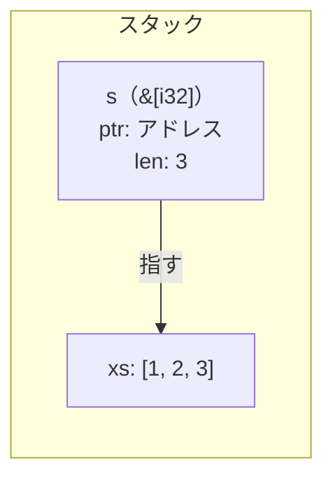

# 配列の借用

前の章で、値を貸すための `&` を見ました。この章では、配列への借用を扱います。C では配列を渡すとき、ポインタと長さを別に扱います。Rust ではスライスという型でまとめて持ちます。この章では、その違いを見ます。

## 配列とスライスは別物

まず言葉を揃えます。C と Rust で「配列」と「スライス」が指すものが異なるので、先に整理しておきます。

C でいう「配列」は `int xs[3]` のような宣言です。Rust にも同じものがあり、`[i32; 3]` と書きます。

| 言語 | 型 | 意味 |
|---|---|---|
| C | `int xs[3]` | 連続メモリ。長さはコンパイラが宣言から知っているだけ |
| Rust | `[i32; 3]` | 連続メモリ。長さ 3 が型の一部 |

C の配列は型の中に長さが入っていません。`sizeof` で計算はできますが、これはコンパイラが宣言 `int xs[3]` を見て算出する値で、実行時に `xs` の中に保存されているわけではありません。

```c
// C
#include <stdio.h>

int main(void) {
    int xs[3] = {1, 2, 3};
    printf("%zu\n", sizeof(xs)); // 12 — int 4バイト × 3個（int が 4 バイトの環境の場合）
}
```

Rust の `[i32; 3]` は長さ 3 が型の一部なので、`len()` はどこでも使えます。

```rust
// Rust
fn main() {
    let xs: [i32; 3] = [1, 2, 3];
    println!("{}", xs.len()); // 3 — 型 [i32; 3] に入っている
}
```

次に「スライス」です。スライスは配列の一部、または全体への参照です。`&xs` と書くと、配列 `xs` を丸ごと借りたスライスになります。C には対応する型はなく、`int *` がその役割を担います。

| 言語 | 型 | 意味 |
|---|---|---|
| C | `int *` | ポインタのみ |
| Rust | `&[i32]` | ポインタと長さのセット |

```rust
// Rust
fn main() {
    let xs: [i32; 3] = [1, 2, 3];
    let s: &[i32] = &xs; // 配列からスライスを作る
    println!("{s:?}");   // [1, 2, 3]
}
```

C で同じことをやろうとすると、配列をポインタに代入した時点でサイズが変わります。`xs` が 12 バイト（int 3個ぶん）だったのが、`s` では 8 バイト（ポインタのサイズ）になります。「3個」という情報は `s` に届いていません。

```c
// C
#include <stdio.h>

int main(void) {
    int xs[3] = {1, 2, 3};
    printf("%zu\n", sizeof(xs)); // 12 — int 4バイト × 3個（int が 4 バイトの環境の場合）（int が 4 バイトの環境の場合）
    int *s = xs;
    printf("%zu\n", sizeof(s));  // 8  — ポインタのサイズ（64ビット環境の場合）。長さの情報が消えた
    printf("[%d, %d, %d]\n", s[0], s[1], s[2]); // 個数を自分で知っていないと書けない
}
```

メモリ上では、`&[i32]` はポインタと長さを並べた 2 語ぶんの大きさになります。



```rust
fn main() {
    println!("{}", std::mem::size_of::<&[i32; 3]>()); // 8  — ポインタ 1 語だけ（64ビット環境の場合）
    println!("{}", std::mem::size_of::<&[i32]>());    // 16 — ポインタ＋長さで 2 語（64ビット環境の場合）
}
```

これで言葉が揃いました。C の配列 `int xs[3]` が Rust の `[i32; 3]`、C のポインタ `int *` が Rust のスライス `&[i32]` に対応します。ただし `&[i32]` はポインタだけでなく長さも持つので、`int *` とは同じではありません。

## 長さがずれるとバッファオーバーランになる

C で配列を関数に渡すとき、長さは別の引数で渡します。渡す値を間違えると、関数は配列の範囲外を読み書きします。

```c
// C
#include <stdio.h>

void print_all(int *xs, int len) {
    for (int i = 0; i < len; i++) {
        printf("%d\n", xs[i]);
    }
}

int main(void) {
    int xs[3] = {1, 2, 3};
    print_all(xs, 5);  // 3個しかないのに5と渡す → 範囲外を読む
}
```

コンパイルは通ります。実行しても止まらないこともあります。やっかいなのは止まらなかった場合で、配列の後ろにあるメモリをそのまま読み、隣の変数の値や意味のないゴミを正しいデータのように扱い続けることがあります。C の標準では配列の範囲外を読み書きした時点で動作は未定義とされており、コンパイラはその先の動作を何も保証しません。範囲外への書き込みは、意図しないメモリを書き換えられるということでもあり、攻撃者がその状況を意図的に作り出してプログラムを乗っ取るバッファオーバーフロー攻撃の足がかりになります。C のソフトウェアで長年報告されてきた脆弱性の多くは、この種の問題に起因しています。

Rust では `&[i32]` を渡します。長さがポインタと一緒に届くので、関数が別途受け取る必要はありません。

```rust
// Rust
fn print_all(xs: &[i32]) {
    for x in xs {
        println!("{x}");
    }
}

fn main() {
    let xs = [1, 2, 3];
    print_all(&xs);  // 先頭アドレスと長さ3がセットで届く
}
```

`print_all` の引数に長さがありません。C では「実際は 3 個だけど 5 と渡す」という書き方ができましたが、Rust では長さを別に渡す設計自体が存在しないので、この種の間違いを書く場所がそもそもありません。関数が受け取った `xs` の中に `len: 3` が入っており、`for x in xs` はその長さぶんだけ回ります。

範囲外にアクセスしようとすれば、実行時にパニックして止まります。C のような未定義動作にはなりません。

```rust
fn main() {
    let xs = [1, 2, 3];
    println!("{}", xs[5]); // thread 'main' panicked: index out of bounds: the len is 3 but the index is 5
}
```

---

C では長さをポインタとは別に渡すため、実際の要素数と渡した値がずれれば範囲外アクセスが起き、コンパイラも実行環境も何も保証しません。Rust のスライス `&[i32]` はポインタと長さをセットで持つので、関数に長さを別途渡す必要がなく、それによる誤りのカテゴリがそもそも存在しません。どうしても範囲外にアクセスしようとしたときは、未定義動作ではなくパニックとして停止します。
