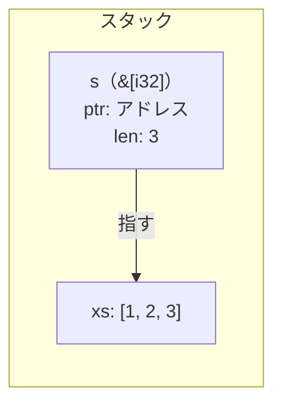

# 配列の借用

前の章で、値を貸すための `&` を見ました。この章では、配列への借用を扱います。C では配列を渡すと長さが消えるため、プログラマが別途管理する必要があり、食い違えばバッファオーバーランになります。Rust はこの問題をスライスで解決します。

## 配列とスライスは別物

まず言葉を揃えます。C と Rust で「配列」と「スライス」が指すものが変わるので、ここを曖昧にしたまま進むと話がすれ違います。

C でいう「配列」は `int xs[3]` のような宣言です。Rust にも同じものがあり、`[i32; 3]` と書きます。

| 言語 | 型 | 意味 |
|---|---|---|
| C | `int xs[3]` | 連続メモリ。長さはコンパイラが宣言から知っているだけ |
| Rust | `[i32; 3]` | 連続メモリ。長さ 3 が型の一部 |

C の配列は型の中に長さが入っていません。`sizeof` で計算はできますが、これはコンパイラが宣言 `int xs[3]` を見て算出する値で、実行時に `xs` の中に保存されているわけではありません。

```c
// C
#include <stdio.h>

int main(void) {
    int xs[3] = {1, 2, 3};
    printf("%zu\n", sizeof(xs)); // 12 — int 4バイト × 3個
}
```

Rust の `[i32; 3]` は長さ 3 が型の一部なので、`len()` はどこでも使えます。

```rust
// Rust
fn main() {
    let xs: [i32; 3] = [1, 2, 3];
    println!("{}", xs.len()); // 3 — 型 [i32; 3] に入っている
}
```

次に「スライス」です。スライスは配列の一部、または全体への参照です。`&xs` と書くと、配列 `xs` を丸ごと借りたスライスになります。C には対応する型はなく、`int *` がその役割を担います。

| 言語 | 型 | 意味 |
|---|---|---|
| C | `int *` | ポインタのみ |
| Rust | `&[i32]` | ポインタと長さのセット |

```rust
// Rust
fn main() {
    let xs: [i32; 3] = [1, 2, 3];
    let s: &[i32] = &xs; // 配列からスライスを作る
    println!("{s:?}");   // [1, 2, 3]
}
```

C で同じことをやろうとすると、配列をポインタに代入した時点でサイズが変わります。`xs` が 12 バイト（int 3個ぶん）だったのが、`s` では 8 バイト（ポインタのサイズ）になります。「3個」という情報は `s` に届いていません。

```c
// C
#include <stdio.h>

int main(void) {
    int xs[3] = {1, 2, 3};
    printf("%zu\n", sizeof(xs)); // 12 — int 4バイト × 3個
    int *s = xs;
    printf("%zu\n", sizeof(s));  // 8  — ポインタのサイズ。長さの情報が消えた
    printf("[%d, %d, %d]\n", s[0], s[1], s[2]); // 個数を自分で知っていないと書けない
}
```

メモリ上では、`&[i32]` はポインタと長さを並べた 2 語ぶんの大きさになります。



```rust
fn main() {
    println!("{}", std::mem::size_of::<&[i32; 3]>()); // 8  — ポインタ 1 語だけ
    println!("{}", std::mem::size_of::<&[i32]>());    // 16 — ポインタ＋長さで 2 語
}
```

これで言葉が揃いました。C の配列 `int xs[3]` が Rust の `[i32; 3]`、C のポインタ `int *` が Rust のスライス `&[i32]` に対応します。ただし `&[i32]` はポインタだけでなく長さも持つので、`int *` とは同じではありません。
