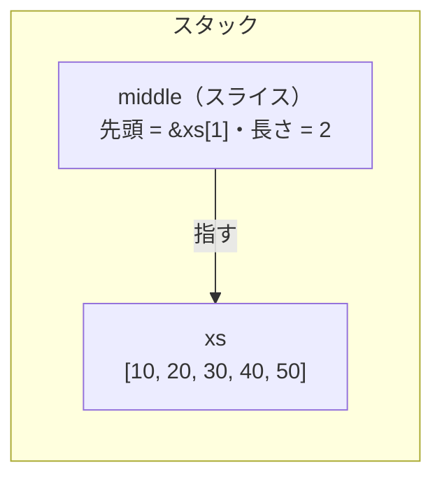

# 借用とスライス

前の章で、値を貸すための `&` を見ました。所有権は元に残したまま、参照だけを渡す借用です。この章では、その借用でコレクションの一部分を貸す形、スライスを見ます。C言語 では配列を扱うたびに、先頭ポインタと長さを別々の変数で持つ必要がありました。Rust ではこの二つが一つの値にまとまり、はみ出しを踏めなくなります。

## 配列を関数に渡すと、長さが消える

C の配列は、関数に渡すと自動的に先頭要素へのポインタに変換されます。配列そのものは渡らず、先頭のアドレスだけが渡るので、いくつ要素があるかという情報は、渡した先には届きません。

```c
// C
void print_all(int xs[]) {
    printf("%zu\n", sizeof(xs)); // 常に 8。配列ではなくポインタのサイズ
}

int main(void) {
    int xs[3] = {1, 2, 3};
    printf("%zu\n", sizeof(xs)); // 12。int 3 個ぶんの大きさ
    print_all(xs);               // 関数の中では 8 になる
}
```

`xs[]` と書いてあっても、受け取っているのは `int *` です。だから要素数は、別の引数として自分で添えて渡すしかありません。

```c
// C
void print_all(int *xs, size_t len) { // 長さを手で渡す
    for (size_t i = 0; i < len; i++) {
        printf("%d\n", xs[i]);
    }
}

int main(void) {
    int xs[3] = {1, 2, 3};
    print_all(xs, 3); // 先頭ポインタと長さを、別々に渡す
}
```

この「先頭ポインタと長さを別々に持つ」ことが、C で配列を渡すときの決まり事でした。そして、その二つが食い違っても、誰も止めてくれません。長さを `3` のつもりで `4` と渡せば、`xs[3]` という確保していない場所を読み書きします。配列の端を越えて隣のメモリに手を出すこの事故が、バッファオーバーランです。

```c
// C
int xs[3] = {1, 2, 3};
print_all(xs, 4); // len を一つ多く渡した
// ループの i == 3 で xs[3] を読む。配列は 0..2 までしか無い
// 隣の何かを読む（未定義動作）。書き込みなら隣のデータを壊す
```

`xs[3]` に何があるかは決まっていません。たまたま読めることもあれば、隣の変数を上書きすることもある。C の配列アクセスは境界を確かめないので、この一行はコンパイルも実行も素通りし、壊れるのは実行時の運まかせです。長さを正しく持ち回るのは、最後までプログラマの責任でした。

## 配列とスライス

Rust には、連続した値を並べる型が二つあります。

```rust
// Rust
let xs: [i32; 3] = [1, 2, 3]; // 配列 [T; N]：長さ N が型に入っている
let s:  &[i32]   = &xs;        // スライス &[T]：型に長さがなく、実行時にポインタと一緒に届く
```

配列 `[T; N]` は長さ `N` が型の一部です。`[i32; 3]` なら「i32 が 3 個」とコンパイル時から決まっていて、変えられません。

スライス `&[T]` は配列や `Vec` への借用で、型に長さがありません。`&xs` と書くと、配列 `[i32; 3]` からスライス `&[i32]` が作られます。C のようにポインタへ崩れるのではなく、ポインタと長さのセットになります。

```rust
// Rust
fn print_all(xs: &[i32]) {
    for x in xs {
        println!("{x}");
    }
}

fn main() {
    let xs: [i32; 3] = [1, 2, 3];
    print_all(&xs); // [i32; 3] → &[i32]。ポインタと長さがセットで渡る
}
```

`print_all` は `xs.len()` で長さを取れますし、`for x in xs` はその長さの分だけ回って止まります。C のように長さを別途渡す必要も、渡した長さと実際の要素数がずれる心配もありません。

一部分だけを貸すこともできます。`&xs[1..3]` と範囲を書くと、その範囲を指すスライスになります。範囲の書き方は基礎の章で見た `0..5` と同じで、後ろの端は含みません。

```rust
// Rust
fn main() {
    let xs = [10, 20, 30, 40, 50];
    let middle = &xs[1..3];   // 添字 1 から 2 まで（3 は含まない）
    print_all(middle);        // [20, 30] を貸す
}

fn print_all(xs: &[i32]) {
    println!("{xs:?}");
}
```

`middle` は新しい配列ではありません。`xs` のメモリの一部を指す、先頭位置と長さ（ここでは 2）の組です。中身はコピーされず、`xs` の要素をそのまま指しています。



借用なので、所有権は元の `xs` に残ったままです。`middle` は `xs` を指しているだけなので、`xs` より長生きはできません。前の章で見た「所有者より長生きする参照はコンパイルが通らない」規則が、そのままスライスにも効きます。指す先が消えたあとに残るダングリングなスライスは、そもそも書けません。

`Vec` も同じようにスライスとして貸せます。`&v[1..3]` は範囲を指すスライスそのものですし、`&v` 全体も、`&[i32]` を受け取る関数に渡すときスライスへ読み替えられます。だから `print_all(xs: &[i32])` は、配列でも `Vec` でも、その一部分でも、同じ一つの関数で受け取れます。C なら「先頭ポインタと長さ」で書いていた汎用の関数が、Rust では `&[T]` 一つで表せます。

スライスがいつも `&` 付きなのは、値の置き場所の決まりから来ています。前提として、Rust で値をスタックにそのまま積めるのは、大きさがコンパイル時に決まっているものだけです。配列 `[i32; 3]` は長さ 3 が型に入っていて大きさが決まるので、スタックに積めます。逆に、長さが型で決まっていないもの——`Vec` のように実行時に伸び縮みする中身がその例で、これはヒープに置いて先頭をポインタで指します——は、大きさが先に決まらず、そのままではスタックに積めません。

スライスは、まさに「長さを型で一つに決めていない」ものです。だから長さ 3 の配列にも 5 の配列にも `Vec` にも、同じ型で貸せました。長さが型に無いぶん大きさも決まらないので、値のままでは持てず、中身が置いてある場所を先頭ポインタで指します。ここは C と同じですが、Rust はそのポインタに長さも一緒に持たせます。この「先頭ポインタ＋長さ」がスライスで、ポインタである印の `&` が付いて `&[i32]` と書きます。

## はみ出しを止める：境界チェック

スライスは長さを内側に持つので、はみ出しをその場で止められます。ここが C との肝心な違いです。

スライスへの添字アクセスは、そのつど添字を長さと突き合わせます。範囲内ならそのまま読み、範囲外ならその場でパニックしてプログラムを止めます。スライスの長さは実行時に決まる値なので、この突き合わせも実行時に起きます。

```rust
// Rust
fn nth(xs: &[i32], i: usize) -> i32 {
    xs[i] // i が範囲外なら、ここでパニックして止まる
}

fn main() {
    let xs = [10, 20, 30];
    let x = nth(&xs, 5); // 長さ 3 のスライスに添字 5。実行時にパニック
    println!("{x}");
}
```

C の `xs[5]` は、確保していない場所を黙って読み書きする未定義動作でした。Rust の範囲外アクセスは、未定義動作ではありません。「範囲外だった」とはっきり分かる、定義された止まり方です。隣のメモリを壊して実行が続いてしまう代わりに、その場で安全に停止します。この境界チェックはデバッグビルドでもリリースビルドでも残り、アクセスごとにごくわずかな実行時コストがかかりますが、そのコストで C のバッファオーバーランを閉め出しています。

配列には、もう一段早い網があります。配列の型 `[T; N]` は長さ `N` を型に含んでいるので、添字が定数で範囲外だと、コンパイラがコンパイルの時点で弾けます。

```rust
// Rust
fn main() {
    let xs = [1, 2, 3];
    let x = xs[5]; // コンパイルエラー：長さ 3 の配列に定数の添字 5 は範囲外
}
```

これは長さが型に書いてある配列だからできることです。長さを実行時に持つスライスでは、添字が定数でも実行時のパニックになります。基礎の章の整数のあふれと同じで、コンパイル時に値が分かるものだけが、実行前に弾けます。

止まってほしくない、範囲外なら別の手を打ちたい、という場面もあります。そのときは `.get()` を使います。`.get()` は添字を渡すと、要素があれば `Some`、無ければ `None` を返します。パニックせず、「有るかもしれない」を返り値で受け取れます。

```rust
// Rust
fn main() {
    let xs = [1, 2, 3];

    match xs.get(5) {
        Some(x) => println!("{x}"),
        None => println!("範囲外なので、ここで手当てする"),
    }
}
```

`Some` / `None` で「無いかもしれない」を型にするこの形は、次の章の `Option` そのものです。ここでは、パニックさせずに範囲外を受け取る道がある、とだけ押さえておけば十分です。

## 書き換えるスライス（`&mut [T]`）

スライスにも、読むだけの `&[T]` と、書き換えられる `&mut [T]` があります。前の章で見た `&` と `&mut` の区別が、そのまま一部分の貸し借りにも効きます。コレクションの一部だけを書き換え用に貸したいとき、`&mut [T]` を渡します。

C で、配列の一部分を関数に書き換えさせるときは、やはり先頭ポインタと長さを渡していました。

```c
// C
void double_all(int *xs, size_t len) {
    for (size_t i = 0; i < len; i++) {
        xs[i] *= 2; // 呼び出し側の配列を、その場で書き換える
    }
}

int main(void) {
    int xs[5] = {1, 2, 3, 4, 5};
    double_all(xs + 1, 3); // 真ん中の 3 つ（xs[1..4]）だけを渡す
    // xs は {1, 4, 6, 8, 5} になる
}
```

Rust では、`&mut xs[1..4]` で真ん中の一部分を書き換え用に貸します。長さは一緒に渡るので、はみ出す心配はありません。

```rust
// Rust
fn double_all(xs: &mut [i32]) {
    for x in xs {
        *x *= 2; // 借りている要素を書き換える
    }
}

fn main() {
    let mut xs = [1, 2, 3, 4, 5];
    double_all(&mut xs[1..4]); // 真ん中の 3 つだけを書き換え用に貸す
    println!("{xs:?}");        // [1, 4, 6, 8, 5]
}
```

標準ライブラリにも、スライスを書き換える操作がそろっています。たとえば `sort` は、借りたスライスの範囲だけを並べ替えます。

```rust
// Rust
fn main() {
    let mut xs = [5, 3, 1, 4, 2];
    xs[0..3].sort();    // 先頭 3 つだけを並べ替える
    println!("{xs:?}"); // [1, 3, 5, 4, 2]
}
```

ここで `&mut` を書いていないのは、`sort` のように書き換えるメソッドを呼ぶと、その範囲への書き換え用の借用が自動で取られるからです。`&mut xs[1..4]` と明示的に貸したのと、起きていることは同じです。

`&mut [T]` にも、前の章の借用のルールがそのまま効きます。書き換えられる借用は同時に一つだけなので、同じ配列の重なる範囲を二つ書き換え用に貸す、といったことはコンパイルが通りません。C なら二本のポインタで同じ場所を指して起こしていたエイリアシングの取り違えが、スライスでも同じく閉め出されます。

---

スライスは、C で手作業だった「先頭ポインタと長さ」の組を、一つの借用にまとめたものです。長さがいつも一緒に届くので、渡す側と受け取る側で長さが食い違うことがなく、はみ出しはコンパイル時か実行時のパニックで止まります。C のバッファオーバーランは、この形の中では書けなくなっています。次の章では、C のヌルポインタにあたる「値が無いかもしれない」を、Rust がどう型で表すかを見ます。ここで少しだけ顔を出した `Option` が、その主役です。
