# ポインタと所有権

C言語 では、ヒープのメモリは自分で管理してきました。`malloc` で確保し、使い終わったら `free` で返す。その一往復のあいだ、守るべきことがいくつもあります。

- 使い終わったブロックを、忘れず解放する
- まだ使うブロックを、早まって解放しない
- 一度解放したブロックを、二度解放しない

この「誰がいつ解放するか」の見張りは、ずっとプログラマの仕事でした。

## 手作業の free が起こす三つの事故

先に、`malloc` と `free` が何をしているのかを一つの型として固定しておきます。ヒープはブロックに区切られていて、`malloc` は空いているブロックを一つ見つけて「使用中」にし、そのアドレス（ブロックがメモリ上のどこにあるか）を返します。`free` は、渡されたアドレスのブロックを「空き」に戻し、あとで再利用できるようにします。どのブロックが空きでどれが使用中かは、`malloc` の側が内部で管理しています（実装ごとに形は違うので、ここでは「空き一覧」のような台帳がある、というモデルで進めます）。

正常な一往復は、こうです。

```c
// C
int *p = malloc(sizeof(int)); // 空きブロックを一つ確保し、そのアドレスを p に入れる
*p = 42;                       // p の指すブロックに 42 を書き込む
free(p);                       // そのブロックを「空き」に戻す
```

確保した直後、`p` はそのブロック（ここでは A と呼びます）を指し、A は「使用中」です。

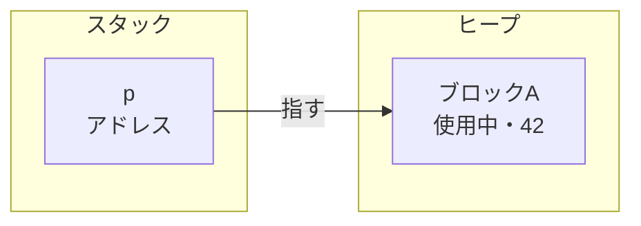

肝心なのは `free(p)` のあとです。A は「空き」に戻りますが、`p` の中身（A のアドレス）はそのまま残ります。`free` はブロックを空きに戻すだけで、指していたポインタには手を触れないからです。つまり `p` は、もう有効でないブロックを指したままになります。これをダングリングポインタと呼びます。解放済みの先を宙ぶらりん（dangling）に指し続けるので、この名前です。上のコードが安全なのは、`free` のあと `p` を二度と使わないから、ただそれだけです。

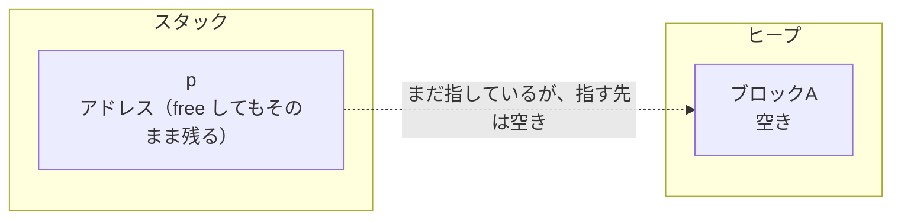

この「`free` してもポインタは元のアドレスを持ったまま」という一点が、これから見る三つの事故すべての根っこにあります。

### 事故1: メモリリーク（free し忘れ）

`free` を呼ばないまま、そのブロックを指す唯一のアドレスを失うと、ブロックは行き場をなくします。

```c
// C
void f(void) {
    int *p = malloc(sizeof(int)); // A を確保
    *p = 42;
}                                  // free せずに return。p はスコープを抜けて消える
```

関数を抜けると、ローカル変数 `p` は消えます。A のアドレスを持っていたのは `p` だけだったので、もう誰も A にたどり着けません。それでいて A は「使用中」のままです。`malloc` から見れば、A はまだ配ったきりで `free` されていないので、空きには戻せません。

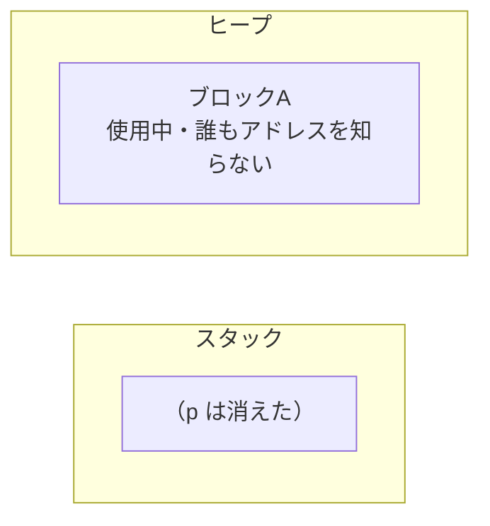

たどり着けないのに解放もできないので、A はプロセスが終わるまで居座り続けます。これがメモリリークです。使えるメモリが、戻ってこないまま少しずつ漏れて減っていくので、リーク（漏れ）と呼びます。一回なら数バイトですが、この `f` を何万回も呼ぶ長時間動くプログラムでは、使われないブロックが積み上がり、やがてメモリを食いつぶします。

なお、リークは未定義動作ではありません。プログラムはそのまま正しく動き続け、ただメモリを無駄に確保したままになる、という行儀の悪さです。壊れないぶん、気づかないまま放置されやすいのが厄介なところです。

### 事故2: use-after-free（解放後に使う）

こんどは逆に、まだ使うのに `free` してしまい、そのあと `p` を使う場合です。

```c
// C
int *p = malloc(sizeof(int));
*p = 42;
free(p);      // A は「空き」に戻る。でも p はまだ A のアドレスを持っている（ダングリング）
*p = 99;      // 空きに戻ったブロックへの書き込み
```

`free(p)` の時点で A は空きに戻り、`p` はダングリングポインタになります。その `p` を通して読み書きすること自体が、C の標準では未定義動作です。実際に何が起きるかは、そのブロックがまだ再利用されていないかどうかで変わります。

再利用される前なら、A にはさっきの `42` がまだ残っていて、`*p` がたまたま読めてしまうこともあります。「動いてしまう」ので、バグが表に出ず、かえって見つけにくくなります。

はっきり壊れるのは、あいだに別の `malloc` が入って A が再利用されたときです。

```c
// C
int *p = malloc(sizeof(int));
*p = 42;
free(p);                       // A は空きに戻る（p はまだ A を指す）

int *x = malloc(sizeof(int));  // 空きになった A が、こんどは x に配られる
*x = 7;
*p = 99;                       // p も A を指したまま。x が入れた 7 を 99 で上書きする
```

`x` は真っ当に `malloc` で受け取った、独立したつもりのポインタです。ところが中身は `p` と同じ A なので、`p` 経由の書き込みが `x` のデータを壊します。書いた本人は `x` しか触っていないつもりなので、原因が `p` 側にあるとは気づきにくい。

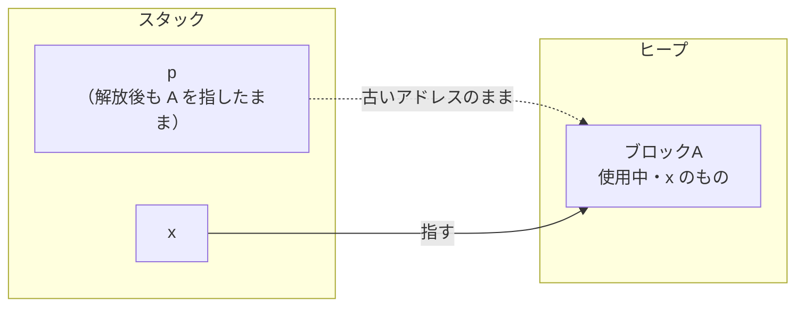

use-after-free の怖さは、`free` した瞬間には何も起きないことです。壊れるのは、あとで同じブロックが別の用途に再利用されてからで、解放した場所と壊れる場所が離れているぶん、原因を追いかけるのが難しくなります。

### 事故3: 二重解放（同じ領域を二度 free）

最後は、同じブロックを二度 `free` する場合です。

```c
// C
int *p = malloc(sizeof(int));
free(p);   // A を「空き」に戻す（1回目）
free(p);   // A はもう「空き」。すでに空きの A を、もう一度「空きに戻せ」と申告する（2回目）
```

ここで、実装によらず確実に言えることが一つあります。二度目の `free` は、すでに空きになっているブロックを、もう一度「空きに戻せ」と `malloc` に申告する操作だ、ということです。同じブロックについて「空き」という指示が二回来る、辻褄の合わない申告になります。この矛盾を `malloc` がどう受け止めるかで、その先は大きく二通りに分かれます。

一つは、その場で検知して即座に異常終了する場合です。`malloc` の中身は処理系ごとに違い、いま使われているものの多くは、直前に解放したばかりのブロックがもう一度 `free` されたことに気づくと、その矛盾した申告を受け付けず、二重登録が成立する前にプログラムを止めます。エラーメッセージは実装ごとに違います。Linux で広く使われる glibc なら `double free or corruption`、macOS が使う別の実装（libmalloc）なら `malloc: *** error ... pointer being freed was not allocated` のような形です。手元で単純に二度 `free` して試すと、多くはこの異常終了になります。

もう一つは、検知をすり抜ける場合です（解放の順序が入り組んでいるときなどに起こり得ます）。このときは矛盾した申告がそのまま通り、空き一覧に同じ A が二重に登録された状態になります。

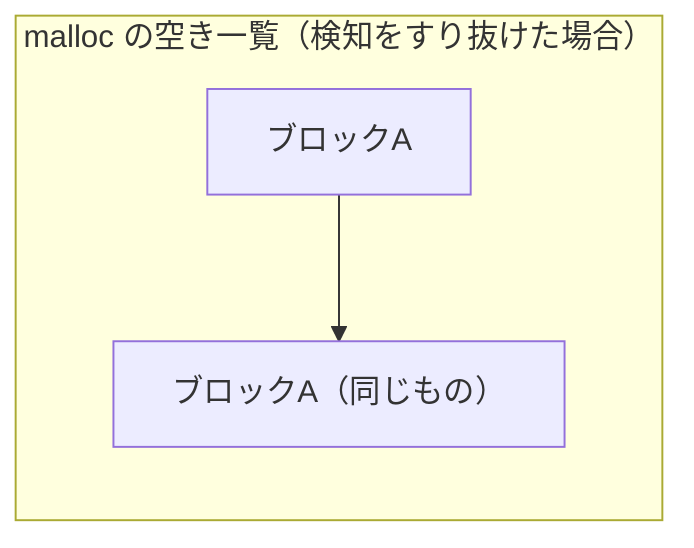

こうなると、空き一覧に二つ載った A が、あとの二回の `malloc` にそれぞれ配られます。

```c
// C（検知をすり抜けた場合）
int *x = malloc(sizeof(int)); // 空き一覧から A を取り出す
int *y = malloc(sizeof(int)); // 一覧にまだ A が残っていて、また A が返る
*x = 7;
*y = 99;                       // x と y は同じ A。x の 7 が壊れる
```

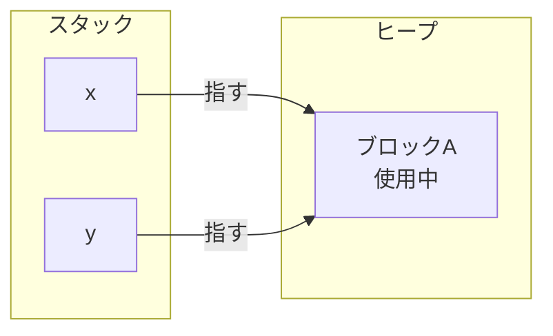

`x` と `y` は別々に `malloc` した独立したポインタのはずなのに、同じ A を指してしまい、事故2と同じ上書きの衝突が起きます。二重解放は、この誤った再利用に加えて、セキュリティ上の悪用の足がかりにもなります。

どちらに転ぶかは処理系まかせで、プログラマからは選べません。確実に言えるのは「すでに空きのブロックを、もう一度空きだと申告した」という矛盾までで、それを検知して止めるか、見逃して壊れるかは保証されません。この予測できなさそのものが、二重解放の危うさです。

---

三つの事故、つまりリーク・use-after-free・二重解放は、どれも `free` を書く場所や回数をひとつ間違えただけで起きます。しかも壊れるのは、解放した場所とは別のところ・別のタイミングなので、クラッシュした現場を見ても犯人がいない。原因の `free` はずっと手前にあり、実行してみるまで気づきにくい。手作業の `malloc` / `free` は、この三つと常に隣り合わせでした。

## malloc / free を手でやる代わりに、コンパイル時に解放を決める

Rust には `malloc` も `free` もありません。その代わり、値をいつ解放するかを、実行時ではなくコンパイル時に決めます。それを担うのが所有権という仕組みです。手でやっていた解放の規律を、コンパイラが肩代わりして強制する、と考えると近いです。ここは C から来た人が最初に戸惑い、理解に時間がかかるところです。ただ、仕組みが分かれば、このあとの借用や文字列、エラー処理で出てくる `&` や `move` も同じ理屈の続きとして読めるようになります。

ではメモリはいつ解放されるのか。答えは、次の一つの規則で決まります。

- 値には所有者がちょうど一つある。
- 所有者がスコープ（`{}` の範囲）を抜けたとき、その値は解放される。

```rust
// Rust
fn main() {
    let nums = vec![1, 2, 3]; // nums がこのベクタの所有者
    println!("{nums:?}");
}                             // main を抜ける → nums が解放される
```

`Vec` は要素をヒープに置く型で、C なら `malloc` で確保していたところにあたります。その中身を解放する担当が `nums` で、`nums` がスコープを抜ける `main` の閉じ括弧の時点で、解放が起きます。C なら手で書いていた `free` が、ここでは所有者がスコープを抜けたという形から自動で決まります。プログラマは `free` を一行も書かず、書き忘れも起きません。

## 値を渡すと所有権が移る（move）

所有者はちょうど一つ、という規則は、代入の意味を C から変えます。

C では、`malloc` で確保した領域を指すポインタを別の変数に代入しても、両方のポインタが同じ場所を指して、どちらからも触れました。

```c
// C
int *s1 = malloc(3 * sizeof(int));
int *s2 = s1;   // s1 と s2 が同じ malloc 領域を指す

free(s1);
free(s2);       // 同じ場所をもう一度 free：二重解放
```

ポインタの代入で写るのは「指す先のアドレス」だけで、`malloc` した領域そのものは複製されません。だから `s1` と `s2` は同じ一つの領域を指します。この状態で両方を `free` すると、同じ場所を二度解放することになります。どちらか一方だけ `free` すればよいのですが、それを守るのはプログラマの責任でした。

Rust で同じことを `Vec` で書くと、`let s2 = s1;` の時点で所有権が `s1` から `s2` へ移ります。移ったあと、`s1` はもう使えません。

```rust
// Rust
fn main() {
    let s1 = vec![1, 2, 3];
    let s2 = s1;        // 所有権が s1 から s2 へ移る

    println!("{s2:?}"); // 使える
    println!("{s1:?}"); // コンパイルエラー：s1 はもう使えない
}
```

理屈は C の二重解放とちょうど裏表です。`Vec` の中身はヒープにあり、`s1` はその場所を指しています。`let s2 = s1;` で写されるのは C と同じく「指す先」だけで、ヒープの `[1, 2, 3]` は複製されません。もし `s1` と `s2` の両方を所有者のまま使えるとすると、二つが同じヒープを指したままになります。

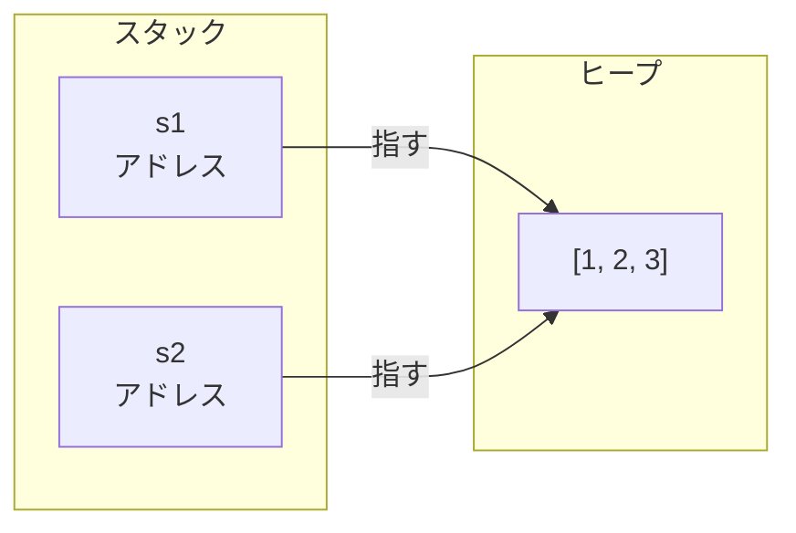

この状態でスコープを抜けると、`s1` と `s2` が同じヒープのメモリをそれぞれ解放しようとします。まさに C で書いた二重解放です。手で `free` を書かない Rust は、これをコンパイル時に防がなければなりません。そこで、代入の時点で所有権を `s1` から `s2` へ移し、担当を一つに保ちます。

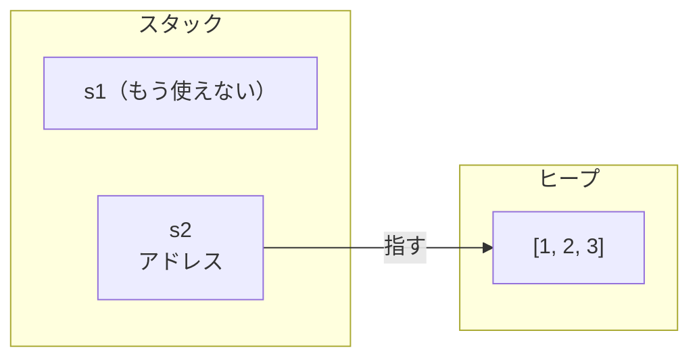

担当は `s2` ただ一つになりました。`s1` はもう所有者ではないので、使えないし、片付けもしません。C なら「`s1` の方はもう `free` しない」と自分で覚えておくところを、Rust は `s1` を使えなくすることで守らせます。担当（所有権）を移す動きが move です。

move は関数に値を渡すときにも起きます。

```rust
// Rust
fn main() {
    let nums = vec![1, 2, 3];
    consume(nums);        // nums の所有権が関数へ移る
    println!("{nums:?}"); // コンパイルエラー：nums はもう使えない
}

fn consume(v: Vec<i32>) {
    println!("{v:?}");
}                         // v がスコープを抜ける → 解放される
```

関数に渡すと、その値の面倒はまるごと関数へ引き継がれます。C にはこの仕組みがありません。ポインタを関数に渡したとき、渡した先で `free` するのか、呼び出し側で `free` するのかは、関数ごとの約束事でした。

```c
// C
// 同じ「ポインタを1つ受け取る関数」でも、free する約束かどうかはバラバラ
void consume(int *p) {
    // ... p を使う ...
    free(p);            // この関数が解放する約束
}

void borrow(int *p) {
    // ... p を読むだけ ...
}                       // 解放しない約束。あとで呼び出し側が free する

int *nums = malloc(3 * sizeof(int));
consume(nums);          // これで解放済み。このあと free(nums) すると二重解放
// もし borrow(nums) だったら、逆にあとで free(nums) しないと漏れる
// どちらの約束かは、関数の中を読むまで呼び出し側からは分からない
```

Rust はこの約束事を型で固定します。`Vec<i32>` を値で受け取った `consume` は所有権ごと受け取り、スコープを抜けるときに解放する。呼び出し側の `nums` は所有権を手放したので、もう使えません。

## 所有権を渡さずに貸す（借用と `&`）

とはいえ、値を使ってほしいだけで、渡したきり返ってこないのでは不便です。関数から返してもらうこともできますが、使うたびに渡して受け取り直すのは、あまりに回りくどい。

そこで、所有権を渡さずに値を貸す借用があります。C でも、大きな struct をコピーせず読み書きさせたいときは、値そのものではなくポインタ `&x` を渡しました。Rust の `&` も見た目は同じで、所有権は元に残したまま、参照だけを渡します。

```rust
// Rust
fn main() {
    let nums = vec![1, 2, 3];
    let n = count(&nums);           // nums を貸す（所有権は渡さない）
    println!("{nums:?} は {n} 個"); // nums はまだ使える
}

fn count(v: &Vec<i32>) -> usize {
    v.len()
}                                   // 借りていただけなので、ここでは解放しない
```

`&nums` で渡すのは参照だけなので、所有権は `nums` に残ります。`count` は値を借りて読むだけで、解放の担当にはなりません。だから呼び出しのあとも `nums` はそのまま使えます。

図にすると、参照は所有者を経由してヒープの中身にたどり着きます。

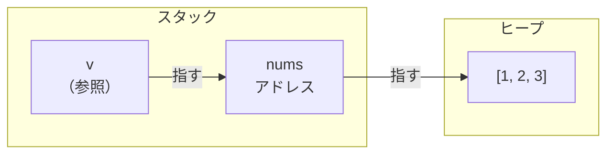

参照の `v` は所有者の `nums` を指し、`nums` がヒープの中身を指しています。片付ける責任は所有者の `nums` に残ったままなので、`count` が終わって `v` が消えても、`nums` とその中身はそのまま残ります。

C のポインタと見た目は似ていますが、一つ大きな違いがあります。C では、指す先がもう生きていない参照でも作れてしまいました。事故2で見た `free` 後のポインタもそうですし、スコープを抜けたローカル変数のアドレスを返す、というのもよくある形です。

```c
// C
// 消えた変数を指す参照を返してしまう
int *make(void) {
    int local = 42;
    return &local;   // local は make を抜けると消える
}                    // 返るのは、もう無い変数を指すダングリングポインタ

int *p = make();
int v = *p;          // すでに無効な場所を読む → 未定義動作
```

解放済みや寿命切れのメモリを指すダングリングポインタで、読み書きすれば未定義動作です。Rust の参照は、指す先の値がまだ生きていることをコンパイラが保証します。所有者より長生きする参照は、そもそもコンパイルが通りません。C なら実行時に踏んでいた use-after-free が、コンパイルの時点で書けなくなっています。

## 読むための借用と、書き換えるための借用（`&mut`）

借用には二種類あります。読むだけの `&` と、書き換えるための `&mut` です。C で `const int *`（読むだけ）と `int *`（書き換えられる）を使い分けていたのに近いですが、Rust はこの区別に規則を付けて強制します。

```rust
// Rust
fn main() {
    let mut nums = vec![1, 2, 3];
    push_four(&mut nums); // 書き換えるために貸す
    println!("{nums:?}"); // [1, 2, 3, 4]
}

fn push_four(v: &mut Vec<i32>) {
    v.push(4);
}
```

そして、この二つには借用のルールが付きます。

- 同じ値に対して、`&`（読むだけの借用）は同時に何個でも作れる。
- あるいは、`&mut`（書き換えられる借用）は同時に一つしか作れない。
- ただし、この二つは両立しない。読んでいる誰かがいる間は、書き換える借用は作れない。

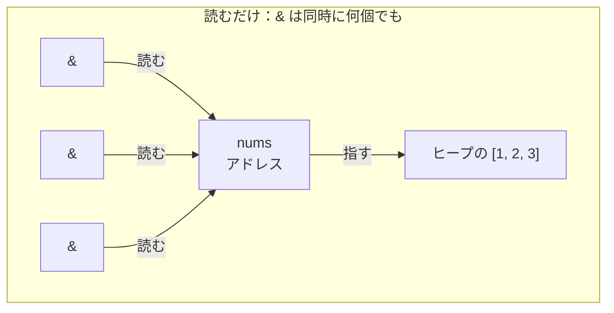

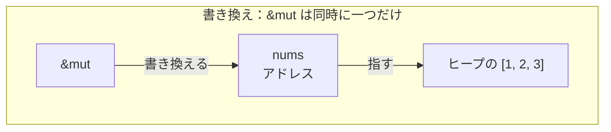

つまり「みんなで読む」か「一人だけが書き換える」かのどちらかで、その中間はありません。

C には、この制約はありません。二本のポインタが同じ場所を指していても、片方で書き換えながらもう片方で読むコードは、そのままコンパイルが通ります。たとえば、二つの引数は別物だというつもりで書いた関数に、同じ変数を二回渡すと、こうなります。

```c
// C
int scale(int *a, int *b) {
    *a = *b * 2;    // b は変えないつもりで、a に b の2倍を入れる
    return *a + *b; // b*2 + b で、b の3倍を返すつもり
}

int x = 10;
int result = scale(&x, &x); // a と b が同じ x を指す（エイリアス）
// *a に書くと、同じ x を指す *b も一緒に変わる：
//   *a = *b * 2  →  x が 20 になり、*b も 20 になる
//   return 20 + 20  →  40。b の3倍（30）にならない
```

`a` と `b` が同じ場所を指していると気づかずに書いたのが原因です。これがエイリアシングのバグで、スレッドを一つも使っていなくても、書き換えた覚えのない `*b` が変わってしまいます。複数スレッドなら、同じデータへの同時読み書きはそのままデータ競合です。どちらも防ぐのはプログラマの責任でした。Rust は借用のルールによって、こうした形をそもそもコンパイル時に弾きます。並行性の章で効いてくるのが、まさにこのルールです。

## move が不便なとき（clone と Copy）

ここまでで、move されると元が使えなくなること、それを避けるには借用することを見ました。もう二つ、覚えておくと楽になる逃げ道があります。

一つは `clone` です。借用ではなく、中身ごと複製したもう一つの値が欲しいときに使います。C なら、もう一つ `malloc` して `memcpy` で中身を写していたところです。

```c
// C
int *s1 = malloc(3 * sizeof(int));
// ... s1 に [1, 2, 3] を入れておく

int *s2 = malloc(3 * sizeof(int)); // 別の領域をもう一つ確保
memcpy(s2, s1, 3 * sizeof(int));   // s1 の中身を s2 に丸ごと写す
// これで s1 も s2 も使える（あとで free(s1) と free(s2) の両方が要る）
```

Rust でこれにあたるのが `clone` です。

```rust
// Rust
fn main() {
    let s1 = vec![1, 2, 3];
    let s2 = s1.clone(); // ヒープの中身ごと複製する
    println!("{s1:?}");  // s1 も使える
    println!("{s2:?}");  // s2 も使える
}
```

`clone` はヒープの中身をまるごと写すのでコストがかかります。Rust が代入で勝手に複製せず `.clone()` と明示させるのは、その重い処理がどこで起きているかをコードの上で見えるようにするためです。

もう一つは、そもそも move されない値があることです。整数・小数・真偽値・`char` のような、ヒープを持たない値は、代入や受け渡しでコピーされ、元もそのまま使えます。C で `int` や `char` を値渡しするとコピーされたのと変わりません。

```rust
// Rust
fn main() {
    let x = 5;
    let y = x;       // コピーされる
    println!("{x}"); // x も使える
    println!("{y}"); // y も使える
}
```

これらの値はヒープに実体を置かず、解放の責任を持たないので、丸ごと写しても二重解放の危険がありません。だから Rust は所有権を移す代わりに複製します。`Vec` のようにヒープに実体を置く値は move、整数のような小さな値はコピー、と見分けておけば、「使えなくなった／使えたまま」の境目がおおよそ型から見当がつきます。

自分で定義した struct は、既定ではこの仲間に入らず move します。コピーで済ませたいときは、その型に `Copy` を付けます。「意図を型に付ける」とはこのことで、付けると小さな値と同じように、代入でコピーされて元もそのまま使えるようになります。

```rust
// Rust
struct Point { x: i32, y: i32 }          // 既定のまま

#[derive(Copy, Clone)]
struct Color { r: u8, g: u8, b: u8 }     // コピーする意図を型に付けた

fn main() {
    let p1 = Point { x: 1, y: 2 };
    let p2 = p1;                    // move。p1 はもう使えない
    // println!("{}", p1.x);        // ここを有効にするとコンパイルエラー

    let c1 = Color { r: 255, g: 0, b: 0 };
    let c2 = c1;                    // Copy が付いているのでコピーされる
    println!("{} {}", c1.r, c2.r);  // c1 も c2 も使える
    let _ = p2;
}
```

---

ここまでが、C で手作業だった `malloc` / `free` の規律を、Rust がコンパイル時に肩代わりする仕組みの骨格です。所有権がどうスタックとヒープに対応するのか、move や借用がメモリ上で何を動かしているのかをもっと詳しく知りたい場合は、[所有権](../../concepts/ownership.md)に、スタックとヒープから move・借用まで、図を交えて順を追って積み上げる解説があります。
