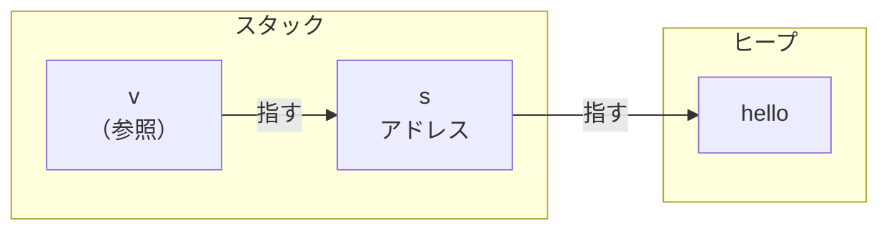
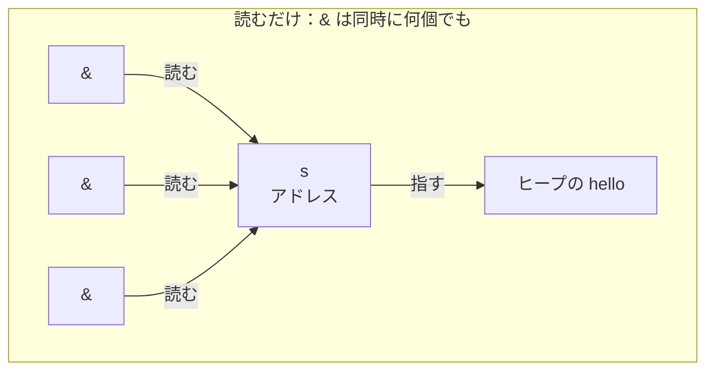
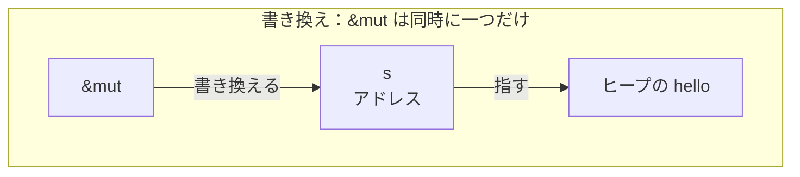

# 参照と借用

所有権を移さずに値を使わせたいときは、借用を使います。

## 所有権を渡さずに貸す（`&`）

C++ では、関数に値を渡すとコピーが起きます。ヒープを持つオブジェクトのコピーはコストがかかるため、読むだけなら参照で受け取ります。`T&` ではなく `const T&` にするのは、この関数が中身を書き換えないことを型で示すためです。

```cpp
// C++
size_t count(const std::string& s) {
    return s.size();
}

int main() {
    std::string s = "hello";
    size_t n = count(s);  // s はコピーされない
    std::cout << s;       // s はまだ使える
}
```

Rust では `&` で渡します。所有権は元に残したまま、参照だけを渡します。

```rust
// Rust
fn main() {
    let s = String::from("hello");
    let n = count(&s);           // s を貸す（所有権は渡さない）
    println!("{s} は {n} 文字"); // s はまだ使える
}

fn count(v: &String) -> usize {
    v.len()
}                                // 借りていただけなので、ここでは解放しない
```

`&s` で渡すのは参照だけなので、所有権は `s` に残ります。`count` は値を借りて読むだけで、解放の担当にはなりません。だから呼び出しのあとも `s` はそのまま使えます。



参照の `v` は所有者の `s` を指し、`s` がヒープの中身を指しています。片付ける責任は `s` に残ったままなので、`count` が終わって `v` が消えても、`s` とその中身はそのまま残ります。

## 指す先が消えた参照

C++ では、スコープを抜けたローカル変数への参照を返せてしまいます。

```cpp
// C++
std::string& make() {
    std::string local = "hello";
    return local;   // local への参照を返す
}                   // make を抜けると local は破棄される

std::string& s = make();
s.size();           // 破棄済みの場所へのアクセス → 未定義動作
```

`make` が返した参照は `local` を指しています。しかし `make` を抜けた時点で `local` は破棄されます。`s` は存在しなくなった変数を指したままになります。これをダングリング参照と呼び、アクセスすると未定義動作になります。

Rust では同じことを書こうとするとコンパイルエラーになります。

```rust
// Rust
fn make() -> &String {
    let local = String::from("hello");
    &local
}

fn main() {
    let s = make();
}
```

```text
error[E0515]: cannot return reference to local variable `local`
 --> src/main.rs:4:5
  |
4 |     &local
  |     ^^^^^^ returns a reference to data owned by the current function
```

所有者より長生きする参照は、そもそもコンパイルが通りません。C++ なら実行時に踏んでいたこの問題が、コンパイルの時点で書けなくなっています。

## 読むための借用と、書き換えるための借用（`&mut`）

C++ では `const T&`（読むだけ）と `T&`（書き換えられる）を使い分けます。Rust では `&`（読むだけ）と `&mut`（書き換えられる）に対応します。

```cpp
// C++
void append(std::string& s) {
    s += " world";
}

int main() {
    std::string s = "hello";
    append(s);
    std::cout << s;  // hello world
}
```

```rust
// Rust
fn main() {
    let mut s = String::from("hello");
    append(&mut s);   // 書き換えるために貸す
    println!("{s}");  // hello world
}

fn append(v: &mut String) {
    v.push_str(" world");
}
```

C++ との違いは、Rust が借用に規則を付けて強制するところです。

- `&`（読むだけの借用）は同時に何個でも作れる
- `&mut`（書き換えられる借用）は同時に一つしか作れない
- この二つは両立しない。読んでいる誰かがいる間は、書き換える借用は作れない





「みんなで読む」か「一人だけが書き換える」かのどちらかで、その中間はありません。

C++ にはこの制約はありません。`const T&` はあくまでその参照経由での書き換えを禁じるだけで、別の参照やポインタが同じオブジェクトを同時に書き換えることは止めません。

```cpp
// C++
int scale(int& a, const int& b) {
    a = b * 2;        // b は変えないつもりで、a に b の2倍を入れる
    return a + b;     // b*2 + b で、b の3倍を返すつもり
}

int x = 10;
int result = scale(x, x);  // a と b が同じ x を指す（エイリアス）
// a に書くと b も一緒に変わる：
//   a = b * 2  →  x が 20 になり、b も 20 になる
//   return 20 + 20  →  40。b の3倍（30）にならない
```

`a` と `b` が同じ場所を指していると気づかずに書いたのが原因です。これがエイリアシングのバグで、書き換えた覚えのない `b` が変わってしまいます。

Rust では同じことを書こうとするとコンパイルエラーになります。

```rust
// Rust
fn scale(a: &mut i32, b: &i32) {
    *a = *b * 2;
}

fn main() {
    let mut x = 10;
    scale(&mut x, &x);  // コンパイルエラー
}
```

```text
error[E0502]: cannot borrow `x` as immutable because it is also borrowed as mutable
 --> src/main.rs:8:19
  |
8 |     scale(&mut x, &x);
  |     ----- ------  ^^ immutable borrow occurs here
  |     |     |
  |     |     mutable borrow occurs here
  |     mutable borrow used here
```

`&mut x` と `&x` を同時に渡せません。借用のルールによって、こうした形をコンパイル時に弾きます。
