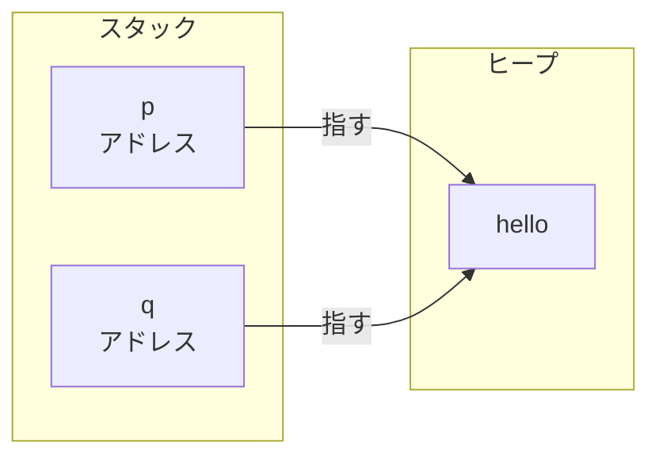
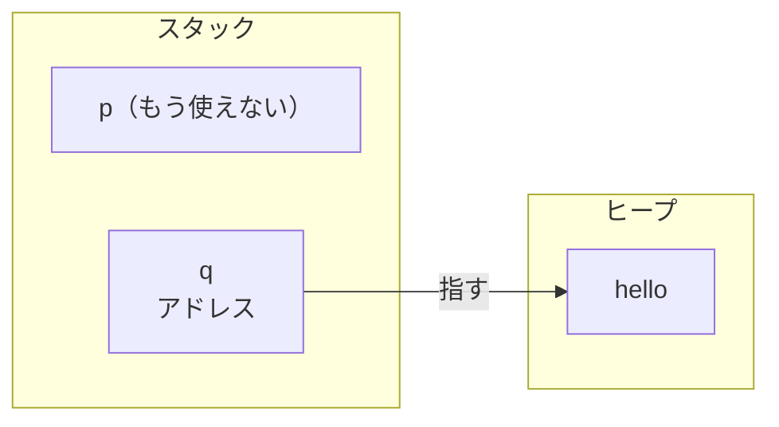

# 所有権とムーブ

C++ でヒープを持つ型を安全に扱うには、コピー・ムーブ・解放を手で管理する必要があります。Rust はこの管理をコンパイラが引き受けます。

## 二重解放と所有権

C++ では、`new` で確保したオブジェクトへのポインタを別の変数に代入すると、両方のポインタが同じアドレスを指します。

```cpp
// C++
std::string* p = new std::string("hello");
std::string* q = p;   // p と q が同じアドレスを指す

delete p;
delete q;   // 同じ場所をもう一度 delete：二重解放
```

ポインタの代入で写るのは「指す先のアドレス」だけで、`new` で確保したオブジェクトそのものは複製されません。だから `p` と `q` は同じひとつのオブジェクトを指します。



この状態で両方を `delete` すると、同じ場所を二度解放することになります。どちらか一方だけ `delete` すればよいのですが、それを守るのはプログラマの責任でした。

Rust で同じことを `String` で書くと、`let q = p;` の時点で所有権が `p` から `q` へ移ります。

```rust
// Rust
fn main() {
    let p = String::from("hello");
    let q = p;       // 所有権が p から q に移る
    println!("{q}"); // 使える
}
```

移ったあと、`p` はもう使えません。

```rust
// Rust
fn main() {
    let p = String::from("hello");
    let q = p;
    println!("{p}"); // コンパイルエラー：p はもう使えない
}
```

`String` の中身はヒープにあり、`p` はその場所を指しています。`let q = p;` で写されるのは C++ と同じく「指す先」だけです。所有権を `p` から `q` へ移すことで、解放を担う変数を一つに絞ります。



所有権を担うのは `q` だけになりました。`p` はもう所有者ではないので、使えないし、片付けもしません。C++ なら「`p` の方はもう `delete` しない」と自分で覚えておくところを、Rust は `p` を使えなくすることで守らせます。

これを規則として言葉にすると、次の三つになります。

1. 各値にはオーナーがいる
2. オーナーは同時に 1 つだけ
3. オーナーがスコープを出ると値は解放される

`let q = p` でオーナーが `p` から `q` に移るため、規則 2 より `p` は使えなくなります。`q` がスコープを出ると規則 3 より値が解放されます。

## コピーかムーブか

C++ では、変数から変数へ値を渡すとデフォルトでコピーが起きます。

```cpp
// C++
std::string a = "hello";
std::string b = a;   // "hello" がヒープごとコピーされる
// a も b も使える
```

ムーブしたいときは `std::move` でキャストします。

```cpp
// C++
std::string a = "hello";
std::string b = std::move(a);   // a の中身が b へ移る
```

ここで勘違いしやすいのが、`std::move` が「ムーブする」という名前だということです。実際には `std::move` は何もムーブしません。中身は型キャストだけです。

```cpp
// std::move の実質的な定義
static_cast<std::remove_reference_t<T>&&>(a)
```

`a` を右辺値参照（rvalue reference）へキャストするだけで、中身は変わりません。C++ は代入のとき、右辺が lvalue（名前のついた変数）ならコピーコンストラクタを、rvalue（一時オブジェクトや `std::move` でキャストしたもの）ならムーブコンストラクタを選びます。`std::move` は lvalue を「rvalue として扱っていい」とマークする道具で、実際のポインタの移し替えはムーブコンストラクタが行います。

デフォルトがコピーなので、ヒープを持つクラスにはコピーとムーブの両方を定義する必要があります。

```cpp
// C++
struct MyClass {
    int* n;
    MyClass(int v) : n(new int(v)) {}
    ~MyClass() { delete n; }

    MyClass(const MyClass& o) : n(new int(*o.n)) {}        // コピーコンストラクタ
    MyClass& operator=(const MyClass& o) {                  // コピー代入演算子
        if (this != &o) { delete n; n = new int(*o.n); }
        return *this;
    }
    MyClass(MyClass&& o) noexcept : n(o.n) { o.n = nullptr; }  // ムーブコンストラクタ
    MyClass& operator=(MyClass&& o) noexcept {                  // ムーブ代入演算子
        if (this != &o) { delete n; n = o.n; o.n = nullptr; }
        return *this;
    }
};
```

コピーコンストラクタ・コピー代入演算子・ムーブコンストラクタ・ムーブ代入演算子・デストラクタの5つが揃ってはじめて安全に扱えます（Rule of Five）。リソースを1つ持つだけのクラスに、これだけの記述が必要になります。

Rust では代入がデフォルトでムーブになります。`std::move` は要りません。

```rust
// Rust
fn main() {
    let a = String::from("hello");
    let b = a;   // a の中身が b へ移る
}
```

C++ でこの区別が必要だったのは、デフォルトがコピーで、ムーブを選ばせるためにキャストが必要だったからです。Rust ではデフォルトがムーブなので、lvalue / rvalue の区別を導入する理由がありません。

コピーが必要なときは `.clone()` と書きます。

```rust
// Rust
fn main() {
    let a = String::from("hello");
    let b = a.clone();           // ヒープの中身ごと複製する
    println!("{} {}", a, b);     // 両方使える
}
```

デフォルトがムーブなので、コピーとムーブを区別する必要がなく、5原則は要りません。

## ムーブ後の変数

`std::move` を使ったあとの変数はどうなるのでしょうか。

```cpp
// C++
#include <string>
#include <iostream>

int main() {
    std::string a = "hello";
    std::string b = std::move(a);

    std::cout << a;   // コンパイルが通る
}
```

`std::move` を呼んだあとも、`a` を使うコードはコンパイルが通ります。C++ の標準ライブラリの型では、ムーブ後の変数を「有効だが不定の状態（valid but unspecified state）」と定義しています。デストラクタが動かない壊れた状態ではなく、使えるが何が入っているかは実装次第です。`std::string` なら通常は空になりますが、それは保証ではありません。バグは実行時に現れます。

Rust では、ムーブ後の変数を使おうとするとコンパイルエラーになります。

```rust
// Rust
fn main() {
    let a = String::from("hello");
    let b = a;
    println!("{}", a);
}
```

```
error[E0382]: borrow of moved value: `a`
 --> src/main.rs:4:20
  |
2 |     let a = String::from("hello");
  |         - move occurs because `a` has type `String`, which does not implement the `Copy` trait
3 |     let b = a;
  |             - value moved here
4 |     println!("{}", a);
  |                    ^ value borrowed here after move
  |
help: consider cloning the value if the performance cost is acceptable
  |
3 |     let b = a.clone();
  |              ++++++++
```

`a` を使おうとした瞬間に、「value moved here」という明確な指摘が返ってきます。C++ ではムーブ後の誤用がコンパイルを通り、Rust ではコンパイル時に止まります。
