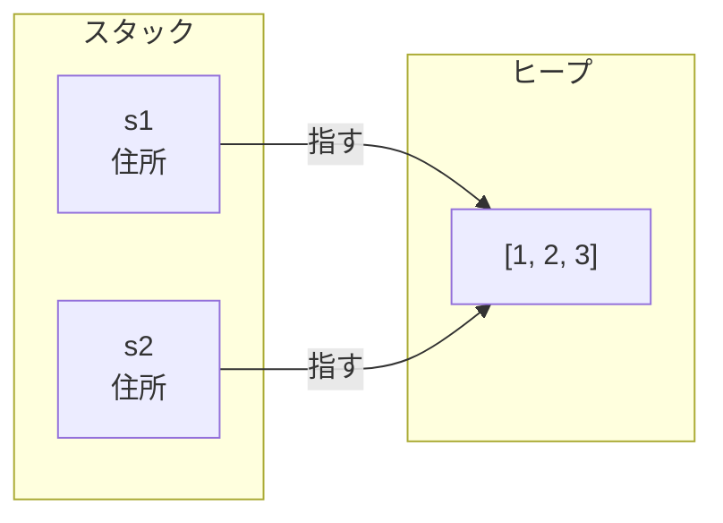
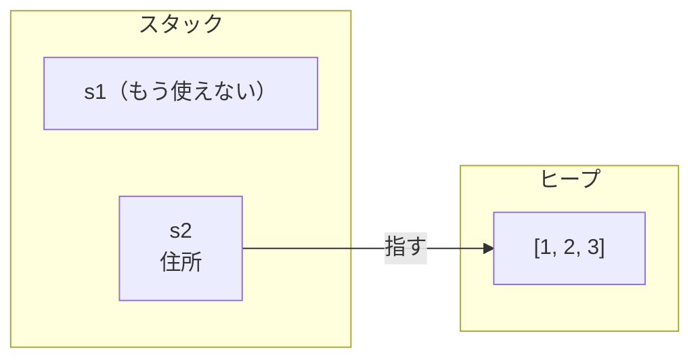
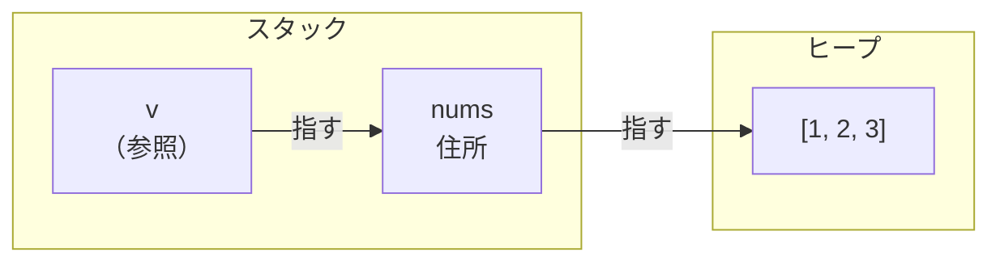
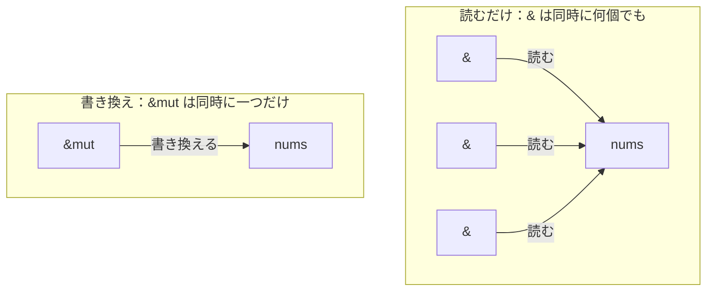

# 所有権と借用

TypeScript を書いているとき、メモリをいつ解放するかを考えることはまずありません。使い終わったオブジェクトは、JavaScript ランタイムの GC（ガベージコレクタ）が実行中に見つけて回収してくれるからです。オブジェクトを作り、変数に入れ、関数に渡し、あとは放っておけばよい。この気楽さが、TypeScript でものを書くときの身軽さを支えています。

Rust には GC がありません。その代わりに、値をいつ解放するかを、実行時ではなくコンパイル時に決めます。それを担うのが所有権という仕組みです。ここは、TypeScript から来た人が最初に戸惑い、そして理解に時間がかかるところです。逆に言えば、ここが腑に落ちれば、このあとのエラー処理や並行性で出てくる `&` や `move` も、同じ理屈の続きとして読めるようになります。

## GC の代わりに、コンパイル時に解放を決める

JavaScript の GC は、どこからも参照されなくなったオブジェクトを見つけて回収します。便利な一方で代償もあります。GC はプログラムの実行中に動くため、その分の CPU と時折の停止時間を消費します。加えて、回収は使い終わった瞬間ではなくあとからまとめて起きるので、その間はメモリを抱えたままになります。多くの用途では気にならないものの、ゼロではありません。

Rust はこのコストをゼロにするために、GC を持たない道を選びました。ではメモリはいつ解放されるのか。答えは次の一つの規則で決まります。

- 値には所有者がちょうど一つある。
- 所有者がスコープ（`{}` の範囲）を抜けたとき、その値は解放される。

```rust
// Rust
fn main() {
    let nums = vec![1, 2, 3]; // nums がこのベクタの所有者
    println!("{nums:?}");
}                             // main を抜ける → nums が解放される
```

`Vec` は要素をヒープに置く型で、TypeScript の配列にあたります。その中身を解放する担当が `nums` で、`nums` がスコープを抜ける `main` の閉じ括弧の時点で、解放が起きます。この解放を、書く側は一行も書きません。GC が実行中に判断する代わりに、コンパイラがコードの形（スコープの終わり）から解放の位置を決めているのです。

## 値を渡すと所有権が移る（move）

所有者はちょうど一つ、という規則は、代入の意味を TypeScript から変えます。

TypeScript では、`const b = a` としても `a` はそのまま使えます。`a` がオブジェクトや配列なら、代入したあとも `a` と `b` の両方から書き換えられ、片方の変更がもう片方にも現れます。こうして一つの配列を共有しても安全なのは、その配列をいつ解放するかを GC が引き受けているからで、書く側はそこを気にせず共有できます。

```ts
// TypeScript
const a = [1, 2, 3];
const b = a;    // a はそのまま使える
b.push(4);
console.log(a); // [1, 2, 3, 4]（b への変更が a にも現れる＝同じ配列）
```

Rust は違います。同じ配列にあたる `Vec` で書くと、`let s2 = s1;` の時点で所有権が `s1` から `s2` へ移ります。移ったあと、`s1` はもう使えません。

```rust
// Rust
fn main() {
    let s1 = vec![1, 2, 3];
    let s2 = s1;        // 所有権が s1 から s2 へ移る

    println!("{s2:?}"); // 使える
    println!("{s1:?}"); // コンパイルエラー：s1 はもう使えない
}
```

なぜこんな制約があるのか。`Vec` の中身はヒープにあり、`s1` はその場所を指しています。`let s2 = s1;` で写されるのはこの「指す先」だけで、ヒープの `[1, 2, 3]` は複製されません。もし `s1` と `s2` の両方を所有者のまま使えるとすると、二つが同じヒープを指したままになります。



この状態でスコープを抜けると、`s1` と `s2` が同じヒープのメモリをそれぞれ解放しようとします。同じ場所を二度解放する、いわゆる二重解放です。GC が無い Rust は、これをコンパイル時に防がなければなりません。そこで、代入の時点で所有権を `s1` から `s2` へ移し、担当を一つに保ちます。



担当は `s2` ただ一つになりました。`s1` はもう所有者ではないので、使えないし、片付けもしません。この「担当ごと引っ越す」動きが move です。

move は関数に値を渡すときにも起きます。

```rust
// Rust
fn main() {
    let nums = vec![1, 2, 3];
    consume(nums);        // nums の所有権が関数へ移る
    println!("{nums:?}"); // コンパイルエラー：nums はもう使えない
}

fn consume(v: Vec<i32>) {
    println!("{v:?}");
}                         // v がスコープを抜ける → 解放される
```

関数に渡すと、その値の面倒はまるごと関数へ引き継がれます。TypeScript の感覚では、配列を渡しても手元の変数はそのまま使えるので、渡した先が所有権ごと持っていくのは、最初に面食らうところです。

## 所有権を渡さずに貸す（借用と `&`）

とはいえ、値を使ってほしいだけなのに、渡したきり返ってこないのでは不便です。関数から返してもらうこともできますが、使うたびに渡して受け取り直すのは、あまりに回りくどい。

そこで、所有権を渡さずに値を貸す借用があります。TypeScript では、オブジェクトを関数に渡しても手元の変数はそのまま使え、関数の中で書き換えれば呼び出し元にも同じ変更が現れました。渡した先と同じものを使っていて、しかも所有権という考えが無かったからです。Rust でこれにあたるのが、`&` を付けて渡す借用です。TypeScript では意識せずにできていたこれを、Rust では `&` で明示します。所有権は元に残したまま、参照だけを貸します。

```rust
// Rust
fn main() {
    let nums = vec![1, 2, 3];
    let n = count(&nums);           // nums を貸す（所有権は渡さない）
    println!("{nums:?} は {n} 個"); // nums はまだ使える
}

fn count(v: &Vec<i32>) -> usize {
    v.len()
}                                   // 借りていただけなので、ここでは解放しない
```

`&nums` で渡すのは参照だけなので、所有権は `nums` に残ります。`count` は値を借りて読むだけで、解放の担当にはなりません。だから呼び出しのあとも `nums` はそのまま使えます。なお `count` の戻り値に付いた `usize` は、要素数のような 0 以上の整数を表す型です。

図にすると、参照は所有者を経由してヒープの中身にたどり着きます。



参照の `v` は所有者の `nums` を指し、`nums` がヒープの中身を指しています。片付ける責任は所有者の `nums` に残ったままなので、`count` が終わって `v` が消えても、`nums` とその中身はそのまま残ります。

TypeScript では、参照している間はそのオブジェクトが GC に回収されないので、無効な参照を持ってしまう心配はありませんでした。Rust の参照も同じ安全を保証しますが、その付け方が違います。指す先の値がまだ生きていることをコンパイラが確かめ、解放済みのメモリを指す参照（ダングリング参照）は、そもそもコンパイルが通りません。GC を使わずに、コンパイル時に同じ安全を実現しているのです。

## 読むための借用と、書き換えるための借用（`&mut`）

借用には二種類あります。読むだけの `&` と、書き換えるための `&mut` です。TypeScript でオブジェクトを関数に渡すと、その関数は中身を書き換えられました。Rust では書き換えを許すときだけ `&mut` を付けて明示的に貸し、`&` で貸したものは読むだけに限られます。

```rust
// Rust
fn main() {
    let mut nums = vec![1, 2, 3];
    push_four(&mut nums); // 書き換えるために貸す
    println!("{nums:?}"); // [1, 2, 3, 4]
}

fn push_four(v: &mut Vec<i32>) {
    v.push(4);
}
```

そして、この二つには借用のルールが付きます。

- 同じ値に対して、`&mut`（書き換えられる借用）は同時に一つしか作れない。
- あるいは、`&`（読むだけの借用）は同時に何個でも作れる。
- ただし、この二つは両立しない。読んでいる誰かがいる間は、書き換える借用は作れない。



つまり「みんなで読む」か「一人だけが書き換える」かのどちらかで、その中間はありません。

TypeScript には、この制約はありません。同じオブジェクトをあちこちから同時に読み書きしても、コードは動きます。ただそのぶん、ある場所が書き換えた値に別の場所が気づかない、といった取り違えには自分で気をつけるしかありませんでした。Rust は借用のルールで、その取り違えが起きうる形をそもそもコンパイル時に弾きます。並行性の章で効いてくるのが、まさにこのルールです。

## move が不便なとき — clone と Copy

ここまでで、move されると元が使えなくなること、それを避けるには借用することを見ました。もう二つ、覚えておくと楽になる逃げ道があります。

一つは `clone` です。借用ではなく、中身ごと複製したもう一つの値が欲しいときに使います。

```rust
// Rust
fn main() {
    let s1 = vec![1, 2, 3];
    let s2 = s1.clone(); // ヒープの中身ごと複製する
    println!("{s1:?}");  // s1 も使える
    println!("{s2:?}");  // s2 も使える
}
```

`clone` はヒープの中身をまるごと写すのでコストがかかります。Rust が代入で勝手に複製せず `.clone()` と明示させるのは、その重い処理がどこで起きているかをコードの上で見えるようにするためです。

もう一つは、そもそも move されない値があることです。整数・小数・真偽値・`char` のような小さな値は、代入や受け渡しでコピーされ、元もそのまま使えます。

```rust
// Rust
fn main() {
    let x = 5;
    let y = x;       // コピーされる
    println!("{x}"); // x も使える
    println!("{y}"); // y も使える
}
```

この線引きは、TypeScript の感覚とよく似ています。TypeScript でも、数値や真偽値のようなプリミティブは代入すると独立した値になり、`const b = a` のあと `b` を変えても `a` は変わりませんでした。一方、オブジェクトや配列は、代入したあと片方を書き換えると、もう片方にも同じ変更が現れました。

```ts
// TypeScript
let a = 1;
let b = a;
b = 2;
console.log(a); // 1（プリミティブは独立。b を変えても a はそのまま）

const xs = [1, 2, 3];
const ys = xs;
ys.push(4);
console.log(xs); // [1, 2, 3, 4]（配列は同じもの。片方の変更が両方に及ぶ）
```

Rust では、その「独立してコピーされる小さな値」にあたるのが整数などの Copy な型で、「書き換えが両方に及ぶ配列やオブジェクト」にあたるのがヒープに実体を置く `Vec` です。違うのは、Rust が後者を move にして、所有者を一つに絞るところです。プリミティブにあたる小さな値はコピー、オブジェクトや配列にあたる `Vec` は move、と対応づけると、「使えなくなった／使えたまま」の境目が型から見当がつきます。

---

ここまでが、TypeScript の GC の代わりに Rust がメモリを管理する仕組みの骨格です。所有権がどうスタックとヒープに対応するのか、move や借用がメモリ上で何を動かしているのかをもっと詳しく知りたい場合は、[所有権](../../concepts/ownership.md)に、スタックとヒープから move・借用まで、図を交えて順を追って積み上げる解説があります。
