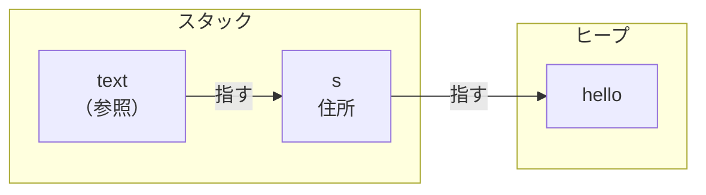
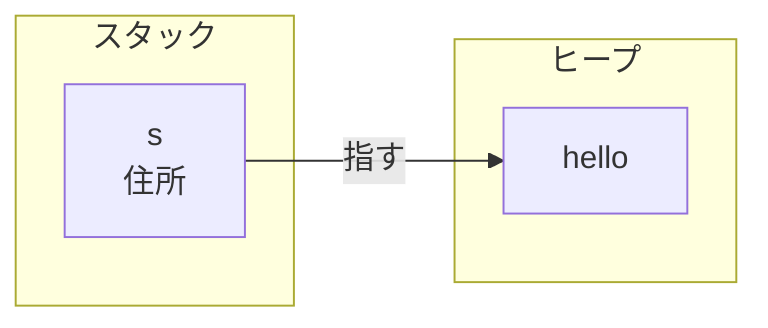
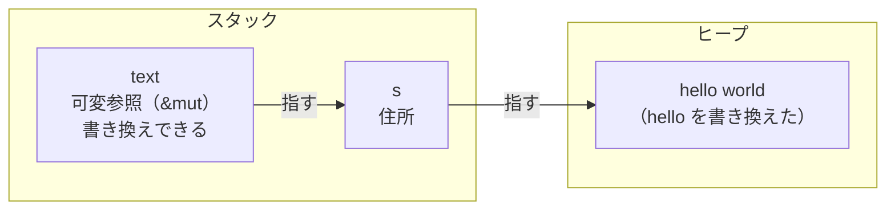

# 借用：所有権を渡さずに貸し借りする

Rust では、値を関数に渡すと所有権がその関数へ移ります。だから、使い続けたいだけの値でも、いったん手放して、関数から返してもらうことになります。ちょっと中身を見たいだけなのに、これはずいぶん回りくどい。

そこで Rust には、所有権を渡さずに値を貸すだけ、という方法があります。参照（`&`）を使った借用です。

## 所有権を渡さずに借りる — `&`

文字列の長さを測る関数を考えます。長さを知りたいだけなので、所有権まで渡す必要はありません。値を借りて、中身を見せてもらえば十分です。

```rust
fn main() {
    let s = String::from("hello");
    let len = calc_len(&s);          // s を貸す（所有権は渡さない）

    println!("{s} の長さは {len}");  // s はそのまま使える
}

fn calc_len(text: &String) -> usize {
    text.len()
}   // text はスコープを抜けるが、所有者ではないので "hello" は解放されない
```

`&s` は、`s` の所有権を渡さずに、`s` を指す参照を作ります。これを、値を借りる（借用）と言います。`calc_len` は `text` を通して `s` の中身を読めますが、`s` の所有者は、あくまで `main` の `s` のままです。だから関数を呼んだあとも、`s` はそのまま使えます。

図にすると、参照は所有者を経由してヒープの中身にたどり着きます。



そして、`calc_len` が終わって `text` がスコープを抜けても、何も解放されません。`text` は借りていただけで、"hello" の所有者ではないからです。片付ける責任は `s` に残ったままです。



参照の `text` だけが消え、`s` とヒープの "hello" はそのまま残ります。借用は、所有権を動かさずに、中身を見せてもらう仕組みだと言えます。

## 何人でも同時に借りられる

`&` の借用には、もう一つ大事な性質があります。同じ値を、同時に何人でも借りられます。

```rust
fn main() {
    let s = String::from("hello");

    let r1 = &s;
    let r2 = &s;
    let r3 = &s;      // いくつ借りても問題ない

    println!("{r1} {r2} {r3}");
}
```

`r1`・`r2`・`r3` は、どれも同じ `s` を指す参照です。三つ同時にあっても、まったく問題ありません。これができるのは、`&` の借用が読むだけだからです。全員が読むだけなら、誰かが読んでいる最中に中身が変わる心配はなく、いくつ貸しても安全に共有できます。

## 借りているだけでは書き換えられない

`&` で借りた参照は読むだけ、と言いました。実際に書き換えようとすると、コンパイラが止めます。試しに、借りた文字列に追記してみます。

```rust
fn main() {
    let s = String::from("hello");
    push_world(&s);
}

fn push_world(text: &String) {
    text.push_str(" world");  // コンパイルエラー：& 越しには書き換えられない
}
```

これはコンパイルエラーになり、`cannot borrow ... as mutable`（可変として借りられない）という形で止められます。共有された借用（`&`）越しには、中身を書き換えられません。読み取り専用だからこそ、さきほどのように何人でも安全に借りられたわけです。

## 書き換えたいときは `&mut`

書き換えたいときは、可変の借用を使います。貸す側で `&mut` を付け、受け取る側も `&mut` で受けます。貸す元の変数も `mut` にしておく必要があります。

```rust
fn main() {
    let mut s = String::from("hello");
    push_world(&mut s);       // 可変で貸す

    println!("{s}");          // hello world
}

fn push_world(text: &mut String) {
    text.push_str(" world");  // 借りたまま書き換えられる
}
```

`&mut s` は、書き換えてよい、という約束つきで貸す借用です。所有権は移らないので、`push_world` を抜けたあとも `s` は `main` のものですが、中身は書き換わっています。所有権を渡さずに、変更だけを任せた形です。

図にすると、形は `&` のときと同じで、`text` が `s` を経由してヒープの中身にたどり着きます。違うのは、その中身を書き換えられるところです。



読むだけの `&` と、書き換えてよい `&mut`。同じ借用でも、できることが変わります。

## 同時に触らせない — 借用の規則

可変の借用には、一つ強い制限があります。ある値を `&mut` で借りている間は、その値を他から借りられません。二つ目の `&mut` も作れないし、読み取りの `&` すら同時には作れません。可変の借用は、いわば独占です。

```rust
fn main() {
    let mut s = String::from("hello");

    let r1 = &mut s;
    let r2 = &mut s;      // コンパイルエラー：同時に二つ目は借りられない

    println!("{r1} {r2}");
}
```

なぜ、ここまで厳しいのでしょうか。プログラムが大きくなると、複数の処理が同時に走り、同じ値に別々の場所から触れる、ということが起きます。そのとき、同じ値を読む処理と書き換える処理が重なると、具体的に困ったことが起きます。

たとえば、片方が文字列に文字を足して伸ばしているとします。文字列が今の場所に収まらなくなると、中身はまるごと、より広い別のメモリへ移され、元の場所は解放されます。ちょうどその最中に、もう片方が元の場所を読んでいたら、すでに解放されたメモリ、つまりもう文字列ではなくなった場所を読んでしまいます。

二つの処理が同時に書き換えても困ります。どちらも「今の末尾はここ」と同じ位置を見て書き込むと、片方の書き込みがもう片方に上書きされて消えたり、書き込んだ長さの記録だけが食い違って、中身と辻褄が合わなくなったりします。

こうした、同じ値への同時アクセスが引き起こす不具合はデータ競合と呼ばれ、原因を追いにくい厄介なもとになります。

多くの言語では、データ競合は動かしてみるまで気づけません。Rust は、可変の借用を同時に一つだけに絞ることで、そもそもデータ競合を書けないようにしています。しかもこの制限は、コンパイル時に確かめられます。実行して初めて壊れるのではなく、コンパイルの段階で止めてくれるのです。

## 文字列は `&str` で借りる

ここまで、文字列を借りるのに `&String` を使ってきました。読むだけの借用なら、実はもう一段よい書き方があります。引数の型を `&String` ではなく `&str` にする、というものです。

`&String` という型は、「`String` を借りている」という意味です。だからこの型を受け取る関数は、呼ぶ側が `String` を持っていないと呼べません。ところが、プログラムの中の文字列は `String` だけではありません。たとえば `"hello"` のようにコードに直接書いた文字列は、`String` ではない別の形で持たれています。`&String` を要求する関数には、こうした文字列を渡せません。

一方 `&str` は、どこにある文字の並びであっても、それを読むために借りる、という型です。`String` は自分の中身を `&str` として貸せますし、`"hello"` のような文字列は最初から `&str` です。だから引数を `&str` にしておくと、`String` からも、コードに直接書いた文字列からも、同じ関数を呼べます。

```rust
fn main() {
    let s = String::from("hello");

    let a = calc_len(&s);        // String を貸す（&str として渡る）
    let b = calc_len("world");   // コードに書いた文字列もそのまま渡せる

    println!("{a} {b}");
}

fn calc_len(text: &str) -> usize {
    text.len()
}
```

読むだけの関数は、中身さえ見られれば十分で、それが `String` なのかどうかまで気にする必要はありません。だから、必要な最小限、つまり「読むための借用（`&str`）」だけを要求しておくと、より多くの相手から呼べる、使い回しの効く関数になります。`String` から `&str` を貸すのに手間もかからないので、文字列を読むために借りるなら `&str` で受ける、と覚えておけば十分です。

## まとめ

- 参照（`&`）を使うと、所有権を渡さずに値を借りられる。借りている間も所有者は元のまま。参照が消えても、借りていただけなので何も解放されない。
- `&` の借用は読み取り専用。同じ値を同時に何人でも借りられる。
- 書き換えたいときは `&mut`。ただし `&mut` で借りている間は、他から一切借りられない（可変の借用は同時に一つだけ）。こうしてデータ競合をコンパイル時に防ぐ。
- 文字列を読むために借りるだけなら、`&String` より `&str` で受けると、`String` からもコードに書いた文字列からも呼べる。
