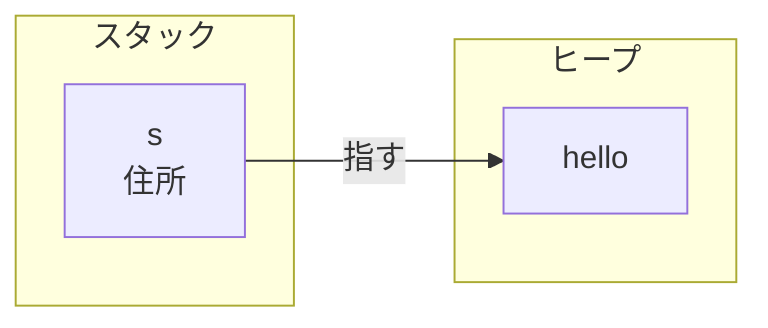
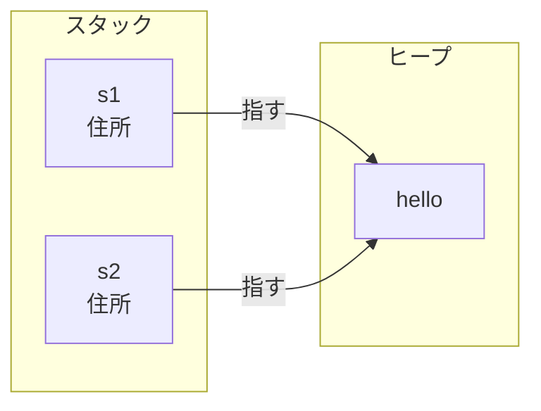
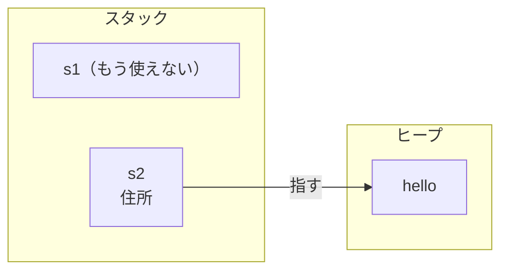
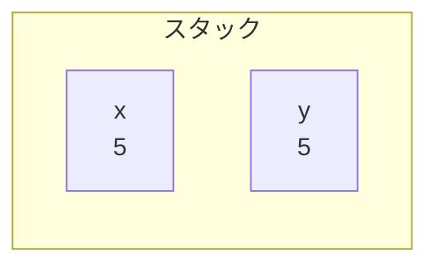
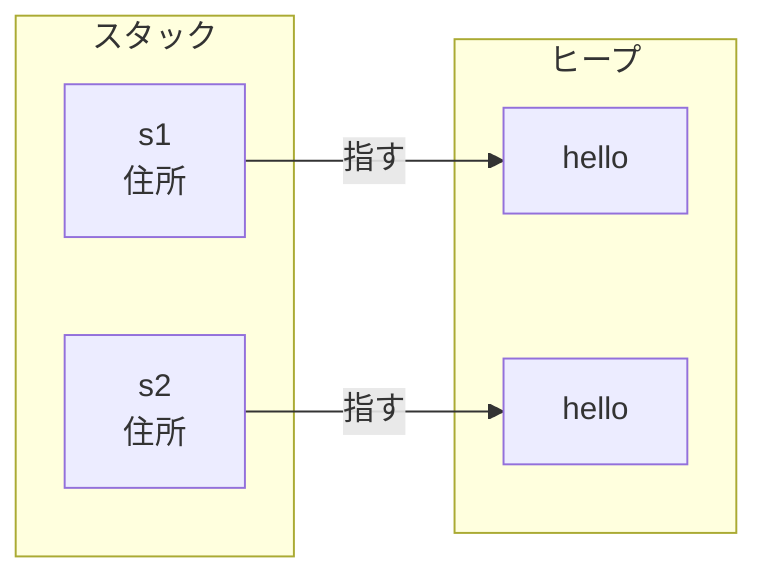

# move：所有権が移る

Rust では、値それぞれに片付ける担当をちょうど一つ決め、その担当の出番が終わったときに、その値を片付けます。これが所有権の要でした。ここからは、その約束が実際のコードでどう働くのかを見ていきます。まずは、担当（所有者）と、出番の終わり（片付け）を、コードの上で確かめます。

## 所有者とスコープ — 値はいつ片付くか

値を変数に束ねると、その変数がその値の所有者になります。所有者は、その値を片付ける担当です。そして、所有者が有効な範囲（スコープ）を抜けると、値は自動で片付けられます。

コードで見てみましょう。

```rust
fn main() {
    let s = String::from("hello"); // s が "hello" の所有者になる

    println!("{s}");               // ここでは s を使える
}                                  // main を抜ける → s が片付けられる
```

`String::from` は、ヒープにメモリを確保して文字列データを置き、その所有者を `s` にします。このとき、スタックとヒープには次のように置かれます。



変数 `s` そのものはスタックにあり、持っているのはヒープの住所だけです。文字列の中身 "hello" はヒープにあります。`s` を使えるのは、束ねられてから、スコープ（ここでは `main` の `{}`）を抜けるまでの間です。`main` の閉じ括弧に来た時点で、Rust は `s` がもう使われないと判断し、スタックの `s` を外すと同時に、住所の先にあるヒープの "hello" も解放します。この片付けを、プログラマは書きません。スコープの終わりが、そのまま片付けの合図になります。

スコープは関数だけとは限りません。`{}` で作った内側のブロックも同じで、そのブロックを抜けた時点で、中で束ねた変数は片付けられます。所有者がどこで生まれ、どこで消えるかは、こうしてコードの形から読み取れます。

## 渡すと所有権が移る

では、この値を別の変数に渡すとどうなるでしょうか。

```rust
let s1 = String::from("hello");
let s2 = s1;      // 所有権が s1 から s2 へ移る

println!("{s2}"); // s2 は使える
println!("{s1}"); // コンパイルエラー：s1 はもう使えない
```

`let s2 = s1;` で代入されるのは、スタックにある住所だけです。ヒープの "hello" そのものは複製されません。つまりこの時点では、`s1` と `s2` が同じ "hello" を指しています。



ここで、もし `s1` と `s2` の両方をそのまま所有者として使えるようにすると、まずいことが起きます。`main` を抜けるとき、`s1` と `s2` の二つが、同じ "hello" のメモリをそれぞれ解放しようとするのです。これは、同じ場所を二度片付けてしまう失敗（二重解放）そのものです。担当はちょうど一つ、という約束が、ここで効いてきます。

Rust はこれを、代入の時点で所有権を `s1` から `s2` へ移してしまうことで防ぎます。移ったあと、`s1` は所有者ではなくなります。



担当は `s2` ただ一つになりました。`s1` はもう所有者ではないので、使えないし、片付けもしません。だから、さきほどのコードで `s1` を使おうとすると、コンパイラが `borrow of moved value: s1`（move したあとの値を使っている）という形で止めます。こうして、二度片付けが起きる余地が、そもそも無くなります。

この「担当ごと引っ越す」動きが move です。単に値を写すのではなく、責任ごと移すからこそ、元は空っぽになります。

## コピーで済む値もある

さきほどの `String` と違って、次のコードはエラーになりません。

```rust
let x = 5;
let y = x;       // x の値がコピーされる

println!("{y}"); // 使える
println!("{x}"); // x もそのまま使える
```

`let y = x;` のあとも、`x` はそのまま使えます。move が起きていないからです。同じ代入なのに、なぜ `String` は move で、数値はコピーなのでしょうか。

違いは、その値がヒープを使っているかどうかにあります。`String` は、中身をヒープに置き、それを解放する責任を負っていました。だから所有者を一つに絞る必要があり、代入では所有権が move しました。

一方、`5` のような整数は、値そのものがスタックに収まっていて、ヒープを使いません。解放する責任もありません。こういう値は、丸ごと写しても安上がりですし、写したところで二重解放のような危険も起きません。だから Rust は、所有権を移すのではなく、値をそのまま複製します。`x` と `y` はそれぞれ独立した `5` を持ち、どちらも自由に使えます。



スタックに `5` が二つ、それぞれ独立して並ぶだけです。`String` のときのような、住所とヒープのつながりは出てきません。だから、片方をコピーしても、もう片方はそのまま残ります。

このように、丸ごと複製しても安全で安上がりな型には、コピーで済むという印（Copy）が付いています。整数・小数・真偽値・文字（`char`）や、それらだけでできたタプルなどが当てはまります。逆に、`String` のようにヒープを使い、片付ける責任を持つ型には Copy は付かず、代入や受け渡しで move します。

見分けの勘どころは、その値が片付ける責任を持つかどうかです。持つなら move、持たないならコピー。ここが分かると、「使えなくなった／使えたまま」の境目が、型を見ただけで見当がつくようになります。

## 同じ中身をもう一つ欲しいとき

move は所有権を移すだけで、ヒープの中身は複製しませんでした。では、`s1` を残したまま、同じ "hello" をもう一つ用意したいときはどうするか。`clone` を使います。

```rust
let s1 = String::from("hello");
let s2 = s1.clone();  // ヒープの中身ごと複製する

println!("{s1}");     // s1 も使える
println!("{s2}");     // s2 も使える
```

`s1.clone()` は、ヒープにある "hello" を丸ごと複製して、別のメモリに置きます。`s2` はその新しい "hello" の所有者になります。`s1` と `s2` は、別々のヒープの中身を一つずつ持つことになります。



指す先が別々なので、`main` を抜けても、二つはそれぞれ別のメモリを一度ずつ解放します。二重解放は起きません。だから `s1` も `s2` も、両方そのまま使えます。

ただし `clone` は、ヒープの中身をまるごと写すぶん、コストがかかります。Rust が代入で勝手に複製せず `.clone()` と書かせるのは、この重い処理がどこで起きているかを、コードの上で見えるようにするためです。move で済むならタダ同然、複製がいるなら明示的に、という切り分けになっています。

## 関数に渡す・返す

move は、変数どうしの代入だけでなく、関数に値を渡すときにも起きます。

```rust
fn main() {
    let s = String::from("hello");
    consume(s);       // s の所有権が関数へ移る

    println!("{s}");  // コンパイルエラー：s はもう使えない
}

fn consume(text: String) {
    println!("{text}");
}                     // text がスコープを抜ける → "hello" が解放される
```

`consume(s)` と呼ぶと、`s` の所有権が引数 `text` へ移ります。変数どうしの代入のときとまったく同じで、渡したあとの `s` はもう使えません。だから、そのあとに `println!("{s}")` と書くと、`borrow of moved value: s` というコンパイルエラーになります。所有権を関数に渡した時点で、呼び出し元は `s` を手放しているのです。

`consume` の側では、所有者になった `text` の出番が関数の終わりで尽きるので、"hello" はそこで解放されます。値を関数に渡すと、その値の面倒はまるごと関数へ引き継がれる、というわけです。

では、渡したあとも呼び出し元で使いたいときは、どうするか。関数から返してもらいます。返すと、所有権が呼び出し元へ戻ってきます。

```rust
fn main() {
    let s = String::from("hello");
    let s = give_back(s);  // 渡して、返してもらう
    println!("{s}");       // また使える
}

fn give_back(text: String) -> String {
    text                   // 所有権を呼び出し元へ返す
}
```

これで `s` は再び使えます。ただ、見てのとおり、ただ使い続けたいだけなのに、いちいち渡して受け取り直すのは、かなり回りくどいやり方です。扱う値が増えれば、返り値の受け渡しだけでコードが埋まってしまいます。

次のページでは、この回りくどさを解消する仕組み、所有権を渡さずに値を貸し借りする借用を見ます。

## まとめ

- 値には所有者がちょうど一つあり、所有者がスコープを抜けると、その値は自動で片付けられる。
- 値を別の変数や関数に渡すと、所有権が移る（move）。移ったあと、元の変数は使えない。同じメモリを二度片付けないよう、担当を一つに保つための仕組み。
- ヒープを持たない小さな値（整数など、Copy が付く型）は、move ではなく複製される。元もそのまま使える。
- 同じ中身をもう一つ欲しいときは `clone` で、ヒープの中身ごと複製する。コストがかかるので明示的に書く。
- 関数に渡すと所有権は関数へ移り、返すと戻ってくる。使い続けたいだけなら、この受け渡しは回りくどい。これを解くのが、次の借用。
