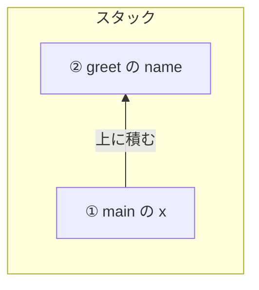
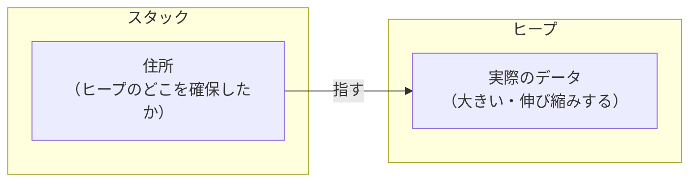

# スタックとヒープ

所有権の話に入る前に、値がメモリのどこに置かれるかを見ておきます。遠回りに思えるかもしれませんが、ここを押さえると所有権の必要性が自然に見えてきます。というのも、所有権が解こうとしている「誰がいつメモリを片付けるのか」という問題は、メモリの片方の置き場所でしか起きないからです。まずはその2つの置き場所を、順番に見ていきます。

## 値には2つの置き場所がある

プログラムが動いている間、変数や値はメモリのどこかに置かれます。その置き場所は大きく2種類あります。スタックとヒープです。

同じ「メモリ」でも、この2つは性格がまったく違います。その違いは、片付けが自動で済むか、自分で決めなければならないか、という差になって表れます。まずはそれぞれがどんな置き場所なのかを順に見て、最後に「なぜこの違いが所有権につながるのか」を確かめます。

## スタック：積み上げて、上から外す

スタックは、値を上へ上へと積み上げていく置き場所です。名前のとおり、積み重ねた皿の山をイメージするとよく合います。新しい値は一番上に置かれ、外すときも一番上から外れます。後から置いたものが先に外れる、という一方向の決まりだけで動きます。

この「上から順に」という単純さのおかげで、スタックはとても速く、置き場所の管理に迷いがありません。

プログラムでは、関数を呼ぶたびに、その関数が使う変数がスタックの上に積まれます。そして関数が終わると、積まれた分はまとめて上から外れます。簡単な例で見てみましょう。

```rust
fn main() {
    let x = 5;      // ① main の変数
    greet();
}

fn greet() {
    let name = "Alice";  // ② greet の変数
}
```

`main` が動き出すと、変数 `x` がスタックに積まれます。`main` の途中で `greet` を呼ぶと、その中の変数 `name` がさらに上に積まれます。



`greet` が終わると、上にある `name`（②）がまず外れ、続いて `main` が終わると `x`（①）が外れます。積んだ順と逆に、上から片付いていきます。ここで大事なのは、この片付けを誰も指示していないことです。関数を抜けた瞬間、その関数の変数は自動で外れます。プログラマは何もしません。

スタックに置けるのは、大きさがあらかじめ決まっている値です。整数や小数のように「何バイト使うか」が最初から分かっているものは、上に積むだけで済みます。

## ヒープ：メモリを確保して、住所を持っておく

スタックにうまく積めるのは、大きさが決まっていて、関数を抜けたら消えてよい値でした。裏を返すと、この積み方に乗らない値もあります。大きさが動かしてみないと決まらない値や、途中で伸び縮みする値、あるいは関数が終わっても残しておきたい値です。決まった大きさの枠に収まらなかったり、関数を抜けても消えてほしくなかったりするので、その本体はスタックに置けません。こうした値を置くのがヒープです。

ヒープは、広い倉庫のような置き場所だと思ってください。値を置きたくなったら、必要な広さのメモリを確保します。確保すると、その置き場所の住所が分かります。値そのものはヒープの中にありますが、手元のスタックには、その住所だけを持っておきます。



値を使うときは、スタックにある住所をたどってヒープの中身に届きます。この住所のことをポインタと呼びます。

メモリを確保したということは、使い終わったら解放しなければならない、ということでもあります。解放を忘れれば、そのメモリは使われないまま居座り続けます。スタックのように「上から外れて自動で片付く」わけではありません。ここに、スタックには無かった問いが生まれます。この確保したメモリを、いつ、誰が解放するのか。

## なぜこの区別が所有権につながるか

2つの置き場所を、片付けという一点で並べてみます。

スタックは、関数を抜ければ中身が自動で外れます。いつ片付くかはコードの形を見れば分かり、片付け忘れも起こりません。

ヒープは違います。確保したメモリは、解放すると決めて解放しないかぎり残り続けます。しかも、いつ解放するのが正しいのかは、その値がもう使われないと分かって初めて決まります。早すぎれば、まだ使いたい値が消えてしまう。遅すぎたり忘れたりすれば、使われないメモリが溜まっていきます。

つまり「誰がいつメモリを片付けるのか」という問題は、まるごとヒープの話です。所有権は、この問いに対する Rust の答えです。次のページでは、この問題に既存の言語がどう答えてきたかを見てから、Rust の答えへ進みます。
