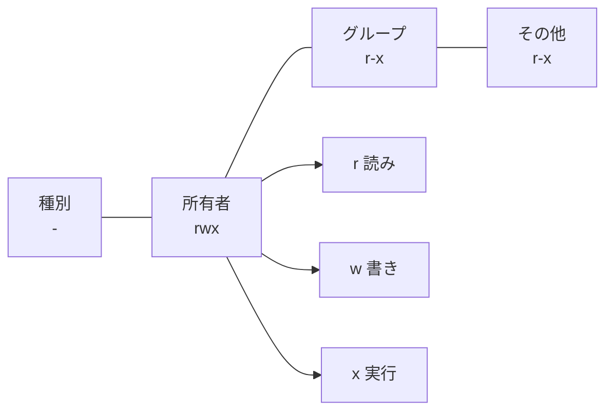

# 初級

Rust の文法を網羅的に学ぶのではなく、バグを一つ修正する過程で必要な知識だけを順番に積み上げます。ゼロからツールを作れるようになるのが理想ですが、そこまでの分量を用意すると最後まで辿り着けません。既存のコードを読んで直す、というスタイルにすることで、最短で「動くものを変えた」体験を積めるようにしています。このガイドを終えると、ファイルのパーミッションがどんなビットでできているかを理解しながらバグを修正し、PR を作成して何をどう変えたかを自分の言葉で説明できるようになります。

このガイドは Linux を前提にします。題材にするファイルのパーミッションは Unix 系 OS の仕組みなので、Windows は対象外です。macOS でもおおむね同じように動きますが、説明と出力例は Linux に合わせています。

## 低レイヤとは

「低レイヤ」とは、普段アプリケーションを書くときには見えてこない、OS やハードウェアに近い側の仕組みのことです。

普段のプログラミングでは、文字列や数値、配列といった扱いやすい形でデータを操作します。その下では、すべてがビット（0 と 1）の並びとして表現され、OS がメモリやファイルを通じてそれを管理しています。低レイヤを扱うというのは、この普段は隠れている「実際にどう表現され、どう管理されているか」に自分で手を入れることです。

この初級編の題材であるファイルのパーミッションは、その入り口にちょうどよい例です。画面では `rwxr-xr-x` のような文字で見えますが、その正体は OS がファイルごとに持っている 1 個の整数——ビットの並び——です。文字として見えているものの下に整数があり、さらにその下にビットがある。この層をたどっていくのが、このガイドの中身です。

## なぜ Rust で低レイヤを扱うのか

多くの言語では、こうした下の層は言語のランタイムやガベージコレクタが肩代わりしてくれて、普段は触れずに済みます。書きやすい代わりに、実際にどう表現され管理されているかは見えにくくなっています。

Rust はシステムプログラミング言語で、C や C++ と同じように OS やハードウェアに近い領域を直接扱えます。ランタイムによる自動管理に頼らず、整数やビットを自分で操作し、OS が持つファイルの情報にもそのままアクセスできます。低レイヤがそのまま見える言語だということです。

それでいて、所有権と型システムによって、低レイヤ特有の危険——確保していないメモリを読み書きしてしまうような失敗——をコンパイル時に防いでくれます。下の層をのぞきながら、足を踏み外しにくい言語です。

この「速くて安全」という性質から、Rust は性能と信頼性の両方が要る場面で採用が広がっています。

- OS やブラウザの中核：Linux カーネルに Rust が取り込まれ始め、ブラウザエンジンの Servo や Firefox の一部も Rust で書かれています。
- ネットワークやインフラ：Cloudflare は自社のプロキシを Rust で書き直しました。大量の通信を高速かつ安全にさばく必要がある領域です。
- 普段使う開発ツール：速さが武器になるところで広く使われています。コマンドラインの `ripgrep`（高速な grep）や `fd`、`bat`、ターミナルの Alacritty。フロントエンドのビルドツール（SWC、Turbopack、Biome）や、Python のツール群（uv、ruff）も Rust 製です。

普段使っているツールの「速さ」の裏に Rust がいる、という場面が増えています。こうした領域に踏み込む最初の一歩として、ファイルのパーミッションは手頃な題材です。

## ls -l のパーミッションを読む

では、その題材であるパーミッションを実際に見てみます。Linux ではファイル一つ一つに、誰が読めて・書けて・実行できるか、という情報が結びついていて、普段それを目にするのが `ls -l` の出力です。まずはそこに何が表示されているのかを読めるようにします。

`ls -l` を実行すると、各行の左端に、そのファイルのパーミッションが表示されます。

```sh
$ ls -l script.sh
```

実行結果

```text
-rwxr-xr-x 1 user user 42 Jun 30 12:00 script.sh
```

左端の `-rwxr-xr-x` がパーミッションです。右に続くハードリンク数・所有者・サイズ・更新日時は、ここでは扱いません。注目するのはこの 10 文字だけです。

10 文字は、先頭の 1 文字と、続く 9 文字に分けて読みます。

先頭の 1 文字はファイルの種別です。通常のファイルなら `-`、ディレクトリなら `d` になります。

続く 9 文字は、3 文字ずつ 3 組に分かれています。左から順に、所有者・グループ・その他のユーザーに対する権限です。各組は読み (r)・書き (w)・実行 (x) の順に並び、その権限があれば対応する文字が、なければ `-` が入ります。`rwxr-xr-x` なら、所有者は読み書き実行のすべて、グループとその他は読みと実行だけ、という意味になります。

図にすると、`-rwxr-xr-x` は左から次のように区切れます。



種別の 1 文字に続いて、所有者・グループ・その他の 3 組が並び、各組の中が読み・書き・実行の順になっています。

## 題材にするツール

このガイドでは、いま見た 10 文字を表示する小さなツールを題材にします。ファイルを引数に渡すと、`ls -l` の左端と同じ 10 文字を表示します。

```sh
$ cargo run -- script.sh
```

実行結果

```text
-rwxr-xr-x  script.sh
```

`ls -l` の左端と同じ `-rwxr-xr-x` が表示されました。この 10 文字は、OS がファイルごとに持っている 1 個の整数を読み解いて組み立てたものです。ツールがやっているのは、その整数から 10 文字を組み立てて並べることだけです。

## バグの内容

通常のファイルに対しては正しく表示できますが、ディレクトリを渡すと先頭の種別がおかしくなります。

`src` はディレクトリです。`ls -l` で見ると先頭が `d` になっています。

```sh
$ ls -ld src
```

```text
drwxr-xr-x  ... src
```

ところが、このツールに同じ `src` を渡すと先頭が `-` のままになります。

```sh
$ cargo run -- src
```

実行結果

```text
-rwxr-xr-x  src
```

種別を表すビットを見ずに、先頭をいつも `-` で埋めてしまっているのが原因です。

期待する出力

```text
drwxr-xr-x  src
```

条件

- 修正後も既存のテストが通ること
- ディレクトリに対するテストを追加すること

## このガイドの進め方

全 6 ページ。コードを手元で動かしながら読み進めると、約 2 時間で完走できます。
