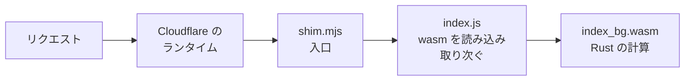

# なぜエッジで動くのか

1章ではサンプルを手元で動かしました。`wrangler dev` で起動して `curl` で応答が返ることを確かめましたがいくつか棚上げにしたことがあります。Rust を書いているのになぜ npm で入れた wrangler が要るのかなぜ JavaScript のファイルが出てくるのかそもそも Rust のコードがどうやってエッジで動くのか。この章でその仕組みを順に見ていきます。

この章の道すじが一度わかればこの先の章はその上に積んでいくだけになります。

## ビルドで何が作られるのか

1章で `wrangler dev` を動かしたときその裏で `build` というフォルダができています。clone した直後には無かったもので`wrangler dev` が起動時に worker-build を呼び出して自動で作る生成物なのでリポジトリには含まれていません。

中の主なものは次の3つです。

```text
build/
├── index_bg.wasm   ← Rust を変換した wasm 本体
├── index.js        ← wasm を読み込んで動かす JavaScript
└── worker/
    └── shim.mjs    ← Cloudflare が最初に読み込む入口
```

`index_bg.wasm` は`lib.rs` と `diff.rs` の Rust を worker-build が wasm に変換したもので計算の中身はここに入っていますがバイナリなので読めません。

`index.js` はその wasm を読み込んで動かすための JavaScript でCloudflare から届いたリクエストを wasm への呼び出しに取り次ぎ返ってきた結果をレスポンスに戻す橋渡しをします。worker-build が自動で生成する長いコードなので中身を読む必要はありません。

`worker/shim.mjs` は`wrangler.toml` が入口として指しているファイルで中を見ると冒頭のコメントを除けば次の2行だけです。

```js
export * from '../index.js';
export { default } from '../index.js';
```

やっていることは `index.js` をそのまま入口として差し出しているだけでCloudflare はまず shim.mjs を読み込みその先の index.js を通して wasm にたどり着きます。

この3つがリクエストを処理するときにどう並ぶのかを見るとそれぞれの役目がはっきりします。1章で `curl` を送ったときその1回のリクエストは次の順にこれらを通っていきました。



リクエストはまず Cloudflare のランタイムに届き入口の shim.mjs から index.js へ進んでその先の wasm にたどり着きwasm が出した結果は来た道を逆にたどってレスポンスとして返ります。1章で `textdiff worker is running` が返ってきたのはこの道を一往復した結果でした。

ここで当然の疑問が出てきます。もとは Rust のコードなのになぜ wasm に変換されしかも JavaScript まで添えられるのかその理由を次の節で見ていきます。

## なぜ wasm と JavaScript が要るのか

エッジのランタイムはふつうのサーバーやコンテナではなく[V8 アイソレート](https://developers.cloudflare.com/workers/reference/how-workers-works/)と呼ばれるものです。

V8 はChrome（Chromium）が JavaScript を動かすのに使っているエンジンでCloudflare はその V8 を軽い箱に区切って動かしています。箱の中で動くのは JavaScript ですが加えて V8 は wasm も読み込んで動かせます。JavaScript が主役の場所なのでCloudflare が最初に読み込む入口も JavaScript でここに Rust を持ち込むために2つのことが起きています。

1つはRust を wasm に変換することです。ふつうにビルドした実行ファイルはマシンの上で直接動くものでこの箱では動きませんがwasm にすれば V8 が読み込んで箱の中で安全にネイティブに近い速さで動かせます。初級で触れた「どこでも安全に動く」という wasm の持ち味がここで効いています。

もう1つはその wasm に JavaScript を添えることです。wasm 単体では入口になれず届いたリクエストをそのまま受け取ることもできないのでそこを worker-build が生成した JavaScript（shim.mjs と index.js）が引き受けます。入口として読み込まれ届いたリクエストを wasm が扱える形に直して渡し返ってきた結果をレスポンスに戻す橋渡しです[^fastly]。

さきほどの図でリクエストが JavaScript を通ってから wasm に届いていたのはこのためでした。

### なぜアイソレートなのか

コンテナや仮想マシンで実行ファイルを動かす方式もありますがそれと比べてアイソレートは起動が桁違いに速く（数ミリ秒）1台のマシンに何千個も詰められ箱どうしの隔離も固いという特徴があります。世界中の拠点に安く・安全に・大量にコードをばらまくというエッジの目的にアイソレートの軽さが噛み合っています。

## Cloudflare のエッジと CDN

1章で近くで動けるのは Cloudflare が世界中に拠点を構えているからと書きましたがその拠点網の正体が CDN です。

Cloudflare はもともと CDN の事業者でCDN とは世界中に置いた拠点に画像やページをキャッシュして利用者の近くから配る仕組みです。遠くの1台まで取りに行かず近くの拠点から返すので速くこの拠点を長い時間をかけて世界中の都市に広げてきました。

エッジコンピュートはその同じ拠点網の上であなたのコードも動かせるようにしたものでCloudflare ではこうして動かすプログラムを Worker と呼びます。1章から動かしてきたのがその Worker で新しいネットワークを引くのではなくCDN が築いた拠点をそのまま計算の場所として使います。

ですからエッジは CDN と別の経路ではありません。リクエストがいちばん近い拠点へ自動でつながって届くところまでは CDN と同じで違うのは着いた拠点で「キャッシュを返す」だけでなく「あなたの Worker が動いて応答を作る」こともできる点です。しかも Worker はキャッシュより手前に立つので最寄りの拠点でキャッシュを見るか元のサーバーに取りに行くかその場で計算して返すかを選べます。

これが1章で見た「近い＝速い」の正体です。CDN が世界中に築いた拠点がそのまま計算の場所になっているので差分の計算を遠くの1台まで往復させず利用者の最寄りの拠点でそのまま済ませられます。

[^fastly]: この JavaScript の層はwasm をエッジで動かすときの決まりごとではなくCloudflare が V8 アイソレート方式を採っているからです。たとえば Fastly の Compute はV8 を介さず wasm を専用のランタイム（Wasmtime）で直接動かすのでこの JavaScript の層が要りません。どちらの方式を採るかは事業者しだいで各社の構成は今後変わることもあるのでここでは Cloudflare の場合はこうなると捉えてください。
