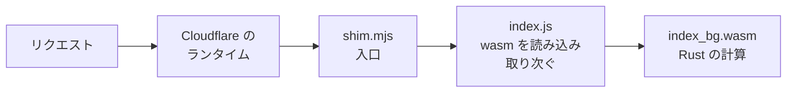

# なぜエッジで動くのか

1章では、サンプルを手元で動かしました。`wrangler dev` で起動し、`curl` で応答が返ることを確かめました。ただ、いくつか棚上げにしたことがあります。Rust を書いているのに、なぜ npm で入れた wrangler が要るのか。なぜ JavaScript のファイルが出てくるのか。そもそも、Rust のコードがどうやってエッジで動くのか。この章で、その仕組みを順に見ていきます。

ここは中級でいちばん考えることの多い章です。ですが、一度この道すじが分かれば、この先の章はその上に積んでいくだけになります。

## ビルドで何が作られるのか

1章で `wrangler dev` を動かしたとき、その裏で `build` というフォルダができています。clone した直後には無かったもので、`wrangler dev` が起動時に worker-build を呼び出して、自動で作ります。生成物なので、リポジトリには含まれていません。

中の主なものは、次の3つです。

```text
build/
├── index_bg.wasm   ← Rust を変換した wasm 本体
├── index.js        ← wasm を読み込んで動かす JavaScript
└── worker/
    └── shim.mjs    ← Cloudflare が最初に読み込む入口
```

`index_bg.wasm` は、`lib.rs` と `diff.rs` の Rust を worker-build が wasm に変換したものです。計算の中身はここに入っていますが、バイナリなので読めません。

`index.js` は、その wasm を読み込んで動かすための JavaScript です。Cloudflare から届いたリクエストを wasm への呼び出しに取り次ぎ、返ってきた結果をレスポンスに戻す、という橋渡しをします。worker-build が自動で生成する長いコードで、中身を読む必要はありません。

`worker/shim.mjs` は、`wrangler.toml` が入口として指しているファイルです。中を見ると、数行しかありません。

```js
export * from '../index.js';
export { default } from '../index.js';
```

やっていることは、`index.js` をそのまま入口として差し出しているだけです。つまり Cloudflare は、まず shim.mjs を読み込み、その先の index.js を通して wasm にたどり着きます。

この3つが、リクエストを処理するときにどう並ぶのかを見ると、それぞれの役目がはっきりします。1章で `curl` を送ったとき、その1回のリクエストは、次の順にこれらを通っていきました。



リクエストはまず Cloudflare のランタイムに届き、入口の shim.mjs から index.js へ進み、その先の wasm にたどり着きます。wasm が出した結果は、来た道を逆にたどってレスポンスとして返ります。1章で `textdiff worker is running` が返ってきたのは、この道を一往復した結果でした。

ここで当然の疑問が出てきます。もとは Rust のコードなのに、なぜ wasm に変換され、しかも JavaScript まで添えられるのか。次の節で、その理由を見ていきます。

## なぜ wasm と JavaScript が要るのか

エッジのランタイムは、ふつうのサーバーやコンテナではありません。[V8 アイソレート](https://developers.cloudflare.com/workers/reference/how-workers-works/)と呼ばれるものです。

V8 は、Chrome（Chromium）が JavaScript を動かすのに使っているエンジンです。Cloudflare は、その V8 をリクエストごとに軽い箱へ区切って動かしています。箱の中で動くのは JavaScript で、加えて V8 は wasm を読み込んで動かせます。JavaScript が主役の場所なので、Cloudflare が最初に読み込む入口も JavaScript です。ここに Rust を持ち込むために、2つのことが起きています。

1つは、Rust を wasm に変換すること。ふつうにビルドした実行ファイルは、マシンの上で直接動くものなので、この箱では動きません。wasm にすれば、V8 が読み込んで、箱の中で安全に、ネイティブに近い速さで動かせます。初級で触れた「どこでも安全に動く」という wasm の持ち味が、ここで効いています。

もう1つは、その wasm に JavaScript を添えること。wasm 単体では入口になれず、届いたリクエストをそのまま受け取ることもできません。そこを、worker-build が生成した JavaScript（shim.mjs と index.js）が引き受けます。入口として読み込まれ、届いたリクエストを wasm が扱える形に直して渡し、返ってきた結果をレスポンスに戻す、という橋渡しです[^fastly]。

さきほどの図で、リクエストが JavaScript を通ってから wasm に届いていたのは、このためでした。

### なぜアイソレートなのか

コンテナや仮想マシンで実行ファイルを動かす方式もあります。それと比べて、アイソレートは起動が桁違いに速く（数ミリ秒）、1台のマシンに何千個も詰められ、箱どうしの隔離も固いという特徴があります。世界中の拠点に、安く・安全に・大量にコードをばらまく。エッジのこの目的に、アイソレートの軽さが噛み合っています。

## Cloudflare のエッジと CDN

1章で、近くで動けるのは Cloudflare が世界中に拠点を構えているから、と書きました。その拠点網の正体が CDN です。

Cloudflare は、もともと CDN の事業者です。CDN は、世界中に置いた拠点に画像やページをキャッシュして、利用者の近くから配る仕組みです。遠くの1台まで取りに行かず、近くの拠点から返すので速い。この拠点を、長い時間をかけて世界中の都市に広げてきました。

エッジコンピュートは、その同じ拠点網の上で、あなたのコードも動かせるようにしたものです。Cloudflare では、こうして動かすプログラムを Worker と呼びます。1章から動かしてきたのが、その Worker です。新しいネットワークを引くのではなく、CDN が築いた拠点を、そのまま計算の場所として使います。

ですから、エッジは CDN と別の経路ではありません。リクエストは、いちばん近い拠点へ自動でつながって届きます。ここまでは CDN と同じです。違うのは、着いた拠点で「キャッシュを返す」だけでなく、「あなたの Worker が動いて応答を作る」こともできる点です。しかも Worker は、キャッシュより手前に立ちます。最寄りの拠点で、キャッシュを見るか、元のサーバーに取りに行くか、その場で計算して返すかを、そこで選べます。

これが、1章で見た「近い＝速い」の正体です。差分の計算を、遠くの1台まで往復させず、利用者の最寄りの拠点でそのまま済ませられる。CDN が世界中に築いた拠点が、そのまま計算の場所になっているからです。

[^fastly]: この JavaScript の層は、wasm をエッジで動かすときの決まりごとではなく、Cloudflare が V8 アイソレート方式を採っているからです。たとえば Fastly の Compute は、V8 を介さず wasm を専用のランタイム（Wasmtime）で直接動かすので、この JavaScript の層が要りません。どちらの方式を採るかは事業者しだいで、各社の構成は今後変わることもあります。ここでは、Cloudflare の場合はこうなる、と捉えてください。
