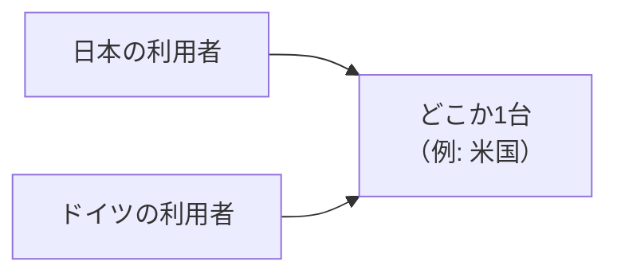
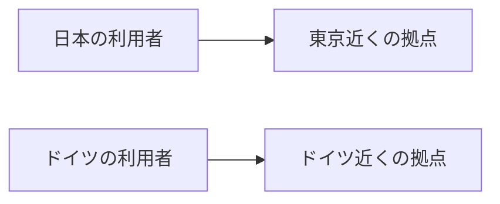

# エッジで動かす

この中級では、初級で手を入れた差分ツールの Rust を、ブラウザの外へ持ち出します。同じ Rust のまま「エッジ」と呼ばれる場所で動かし、最後には誰でも呼び出せる URL として公開します。まずは用意したサンプルを手元で動かして、ちゃんと動くことを目で確かめましょう。

「エッジ」という言葉に馴染みがなくても大丈夫です。プログラムは、ふつうはどこか1台のサーバーに置いて動かします。エッジは、世界中に散らばった拠点のうち、問い合わせてきた人のいちばん近くでコードを動かす仕組みです。

ふつうのサーバーだと、どこにいる利用者も同じ1台まで問い合わせに行きます。遠いほど往復に時間がかかります。



エッジだと、それぞれの利用者に近い拠点で同じコードが動きます。遠い1台まで往復しないぶん、速く返ります。



こうして近くで動けるのは、Cloudflare が世界中に拠点を構えているからです。その拠点網が何なのかは、次の章でくわしく見ます。

差分ツールは、こういうエッジ向きの仕事の代表です。差分の計算は、入力のテキストさえ渡せば答えが出ます。どこかに貯めたデータを読みに行く必要がありません。こういう計算は、世界中のどの拠点に置いても同じように動くので、利用者の近くにいくつでも配れます。

データベースに貯めた情報を読み書きするツールだと、そうはいきません。データのある場所に縛られるので、近くの拠点で動かしても、結局そのデータのある1台まで問い合わせに行くことになりがちです。差分ツールにはこの縛りがなく、利用者の近くで動かすのに向いています。今回はその場所として Cloudflare のエッジを使います。

なぜ Rust がエッジで動くのか、その仕組みは次の章で見ていきます。ここではまず動かして、「動いた」を体験することに集中します。

## エッジで動かす準備をする

初級では、Rust をブラウザで動かすために rustup と wasm-pack を入れました。エッジで動かすときも、そのための準備が要ります。Rust と cargo はすでに入っている前提で、ここでは wrangler と worker-build の2つを入れます。

### Cloudflare を操作する wrangler を入れる

wrangler は、Cloudflare を手元から操作するための CLI です。この章でローカルで動かすときも、最後に公開するときも、これを通して行います。

wrangler は npm で配られているので、Node.js が必要です。入っていなければ [nodejs.org](https://nodejs.org) から入れておきます。

```sh
$ npm install -g wrangler
```

入ったか確認します。

```sh
$ wrangler --version
```

バージョン番号が表示されれば成功です。

### Rust をエッジ用に変換する worker-build を入れる

worker-build は、Rust をエッジで動く形に変換するライブラリです。初級でブラウザ用に使った wasm-pack と、やっていることはよく似ています。どちらも Rust を wasm に変換し、JavaScript から使えるように包むライブラリで、違うのは包む相手だけです。wasm-pack はブラウザ用に、worker-build はエッジ用に包みます[^tools]。

ふつうにビルドした実行ファイルはエッジに置けないので、このひと手間が要ります。変換して何ができるのかは次の章で見ます。ここではライブラリを入れておくだけです。

wrangler が裏でこの worker-build を呼び出すので、cargo で入れておきます。

```sh
$ cargo install worker-build
```

これで、サンプルを動かす準備ができました。

## サンプルを動かす

使うのは、この中級のはじめに clone したスターターです。ここには、初級で手を入れた、差分を計算する Rust のコードと、それをエッジで受け取って動かすためのコードが入っています。ただし2つはまだつながっていないので、いまはリクエストが来ても差分は計算せず、決まった文字列を返すだけです。まずはこの状態のまま、手元で動くことを確かめます。

サンプルのフォルダに移ります。

```sh
$ cd rust-guide-sample-intermediate-wasm
```

wrangler で起動します。

```sh
$ wrangler dev
```

初回はビルドに少し時間がかかります。起動すると、手元で Cloudflare と同じランタイムが立ち上がり、リクエストを待つ状態になります。

別のターミナルから呼び出してみます。

```sh
$ curl http://localhost:8787
textdiff worker is running
```

この応答が返れば、Rust のコードが手元で動いています。ただしこれは本物のエッジ（世界中の拠点）ではなく、Cloudflare のエッジと同じランタイムを手元で立ち上げて動かしている状態です。世界に公開するのは最後のデプロイの章で、それまではこの手元の環境で開発を進めます。差分の計算はまだですが、Rust がこのランタイムの上で動く、という出発点はこれで確認できました。

止めるときは、起動したターミナルで Ctrl-C を押します。

## リクエストを受けてレスポンスを返す

動いたところで、いま何が動いたのかをコードで確かめます。開くのは `src/lib.rs` で、ここがリクエストの入口です。

```rust
#![allow(dead_code)]

use worker::*;

mod diff;

#[event(fetch)]
async fn fetch(_req: Request, _env: Env, _ctx: Context) -> Result<Response> {
    Response::ok("textdiff worker is running")
}
```

短いですが、このプログラムの骨組みがここに詰まっています。

`#[event(fetch)]` は、「リクエストが届いたら、この関数を呼んでください」という目印です。なぜこの目印だけで呼ばれるのか、その仕組みは次の章で見ます。ここでは、リクエストのたびにこの関数が動く、とだけ押さえておきます。

関数の形を見ると、受け取るものと返すものがはっきりしています。引数の `Request` が届いたリクエストで、戻り値の `Response` が返す応答です。リクエストを受け取って、レスポンスを返す。これが、エッジで動かすプログラムのいちばん基本の形です。

いまの中身は、その最小です。`Response::ok(...)` で、決まった文字列をそのまま返しているだけです。引数の `_req` に付いた `_` は、受け取ったリクエストの中身を使っていない印で、だからさきほど curl で何を送っても、同じ `textdiff worker is running` が返ってきました。

先頭に近い2行にも、これから使うものが用意されています。`mod diff;` は、初級で手を入れた差分のコード（`src/diff.rs`）をこのプログラムに取り込む宣言です。ただし取り込んだだけで、この関数からはまだ呼んでいません。もう1つの `#![allow(dead_code)]` は、取り込んだのにまだ使っていないコードに Rust が出す警告を、いまは黙らせておくものです。3章で差分のコードを実際に呼べば、どちらも役目どおりに働きはじめます。

この「リクエストを受けてレスポンスを返す」形が、これから育てていく土台です。3章では、この関数の中に初級で手を入れた差分のコードを差し込み、送られてきたテキストの差分を返すようにしていきます。いまは空っぽの受け皿ですが、置き場所はもうできています。

次の章では、ここでは触れなかった「なぜこのコードがエッジで動くのか」の仕組みを見ていきます。

[^tools]: wasm-pack は Rust と WebAssembly のコミュニティが作っている汎用ライブラリで、ホストを問わず「Rust を wasm にして包む」用途に使えます。worker-build は Cloudflare 自身が Workers 向けに作ったライブラリです。初級とライブラリが変わるのは、包む相手がブラウザから Cloudflare のエッジに変わったからで、中身はどちらも wasm-bindgen という同じライブラリを使っています。
